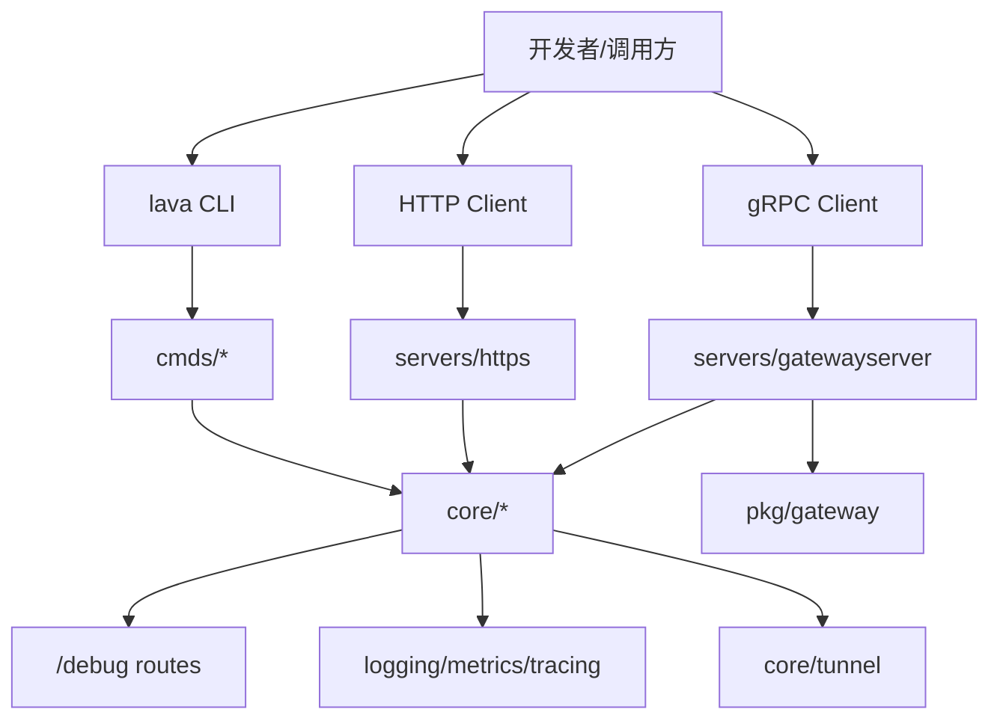

# Lava

Lava 是一个面向 Go 微服务场景的中台集成框架，提供统一的服务抽象、调试能力、网关能力、隧道能力与开发工具链。

## 核心能力

- 统一服务抽象：HTTP / gRPC / 定时任务 / Tunnel Gateway
- 统一中间件模型：`lava.Middleware` 一套接口覆盖多组件
- 可观测性内建：日志、指标、调试路由（`/debug`）
- 网关能力：`pkg/gateway` 提供 HTTP/JSON 到 gRPC 的转换
- 本地开发工具：`watch`、`curl`、`devproxy`、`fileserver`
- Protobuf 工程化：`protobuf.yaml` + `task proto:*`

## 快速开始

### 1) 环境要求

- Go `1.25+`
- Task（推荐）

### 2) 获取源码

```bash
git clone https://github.com/pubgo/lava.git
cd lava
go mod tidy
```

### 3) 基础检查

```bash
task test
task lint
```

### 4) 构建并体验 CLI

```bash
go build -o lava .
./lava
```

## 当前入口命令（`main.go`）

> 以仓库根入口 `main.go` 为准。

| 命令                    | 说明                                            |
| ----------------------- | ----------------------------------------------- |
| `lava watch`            | 文件变更监听并自动执行命令                      |
| `lava curl`             | 面向 Gateway 的 HTTP 调试客户端（支持 `login`） |
| `lava tunnel gateway`   | 启动 Tunnel Gateway                             |
| `lava fileserver <dir>` | 本地目录静态文件服务                            |
| `lava devproxy`         | 本地开发代理（DNS + HTTP 反向代理）             |

## 架构速览



## 文档导航

- 文档总览：`docs/README.md`
- 架构文档（含流程图）：`docs/architecture-v2.md`
- 设计文档（含关键抽象）：`docs/design-v2.md`
- zrpc 文档：`docs/zrpc.md`
- 命令文档：`docs/lava-command.md`
- 模块总览：`docs/modules/README.md`
	- Core：`docs/modules/core.md`
	- Servers：`docs/modules/servers.md`
	- Clients：`docs/modules/clients.md`
	- Pkg：`docs/modules/pkg.md`
	- Cmds：`docs/modules/cmds.md`

## Protobuf 流程

```bash
task proto:fmt
task proto:lint
task proto:gen
```

配置位于 `protobuf.yaml`，生成代码输出到 `pkg/proto`。

## zrpc 快速入口

仓库已经内置一条基于 NATS 的 protobuf unary RPC 能力：

- runtime：`pkg/zrpc`
- server host：`servers/zrpcs`
- client：`clients/zrpcc`
- demo：`internal/examples/zrpcdemo`

相关使用方式见：`docs/zrpc.md`

## 许可证

本项目使用 `LICENSE` 中定义的开源许可证。
