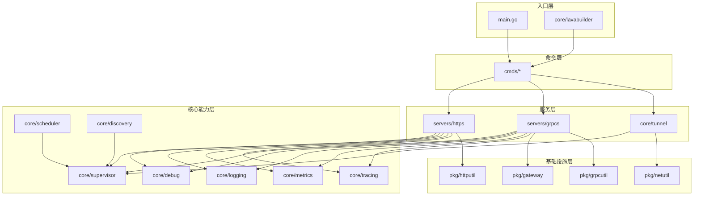
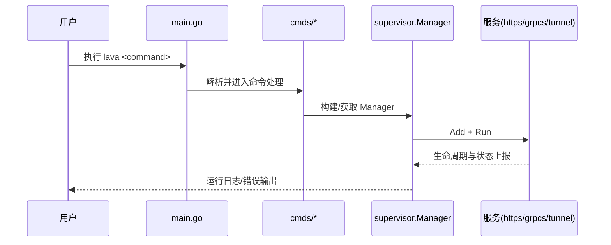
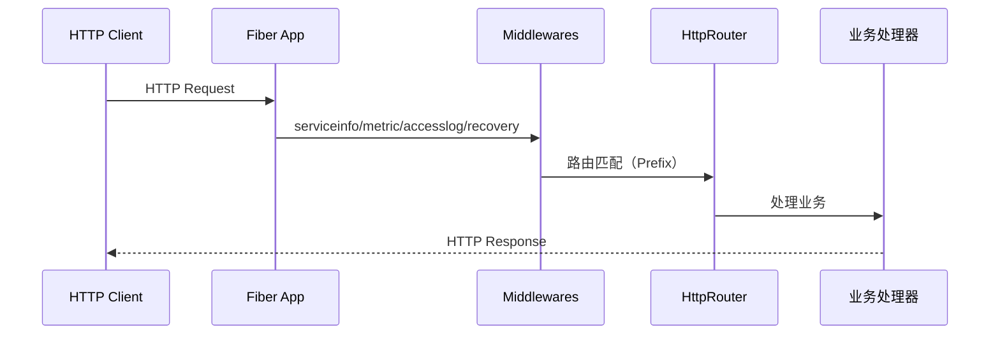
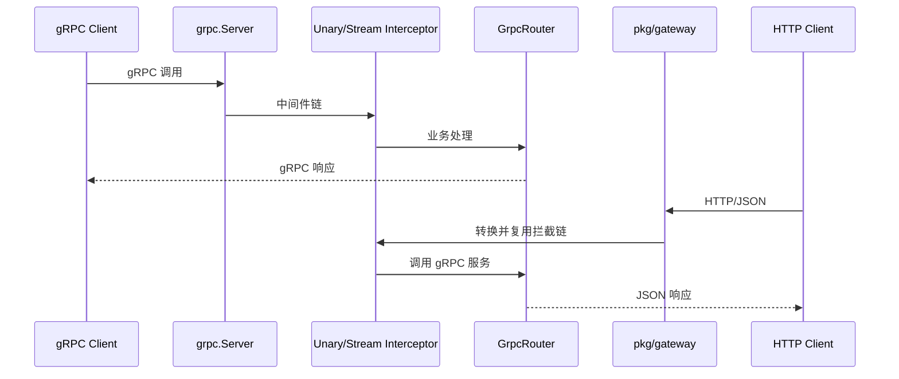
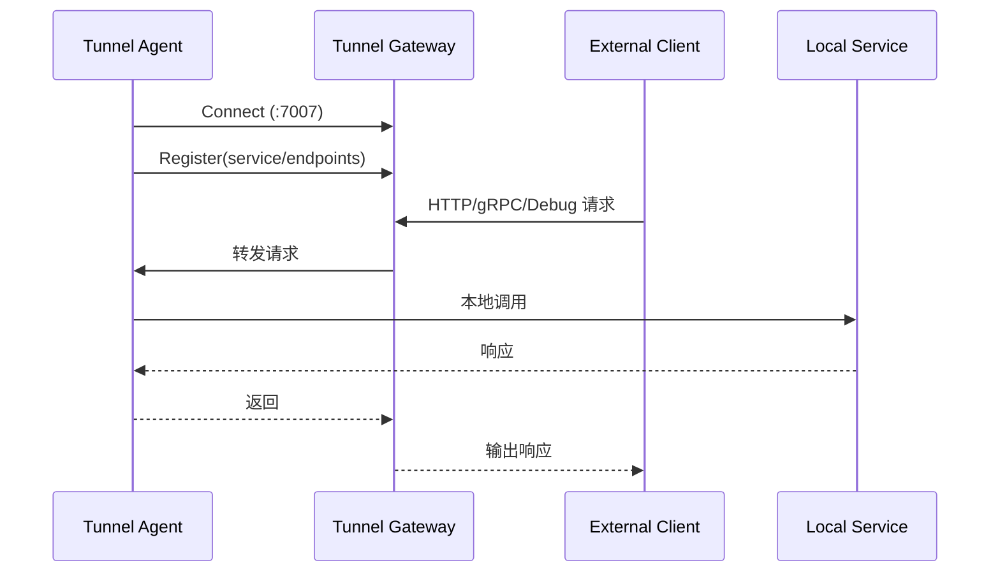

# Lava 架构文档（v2）

> 本文档描述当前仓库的实际分层与关键运行流程，重点面向开发与维护。

## 1. 分层视图

## 2. 启动流程

Lava 当前存在两套常见入口：

1. `main.go`：偏工具化 CLI（已接入 `watch/curl/tunnel/fileserver/devproxy`）
2. `core/lavabuilder.Run`：偏 DI 装配入口（注入 `version/health/dep/grpc/http/cron/tunnel` 等命令）

## 3. HTTP / gRPC 请求路径

### 3.1 HTTP 服务器（`servers/https`）

### 3.2 gRPC 服务器（`servers/grpcs`）

## 4. Tunnel 反向连接流程

`core/tunnel` 使用 Agent 主动连接 Gateway 的模式，适合内网服务暴露与远程调试。

## 5. 目录与模块锚点

- 入口：`main.go`、`core/lavabuilder/builder.go`
- 服务：`servers/https`、`servers/grpcs`
- 核心：`core/supervisor`、`core/debug`、`core/tunnel`
- 组件：`clients/*`、`pkg/*`、`lava/*`

详细模块信息见：`docs/modules/README.md`。
