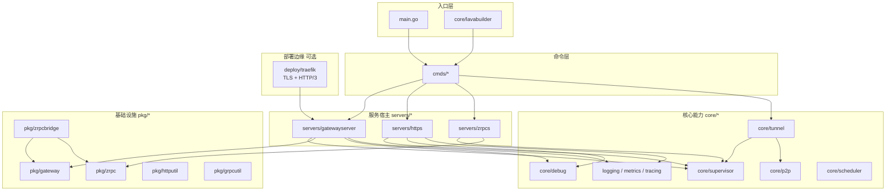
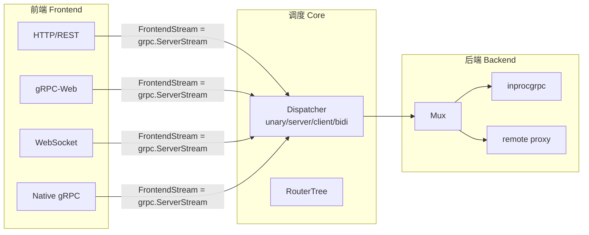
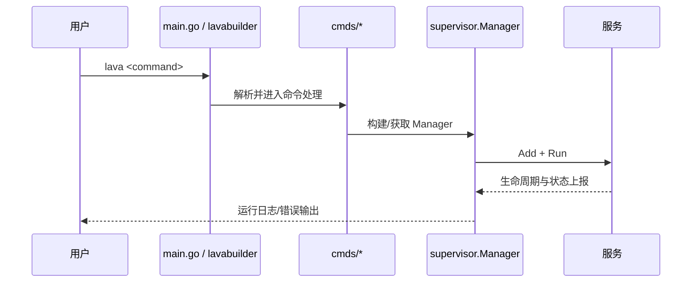
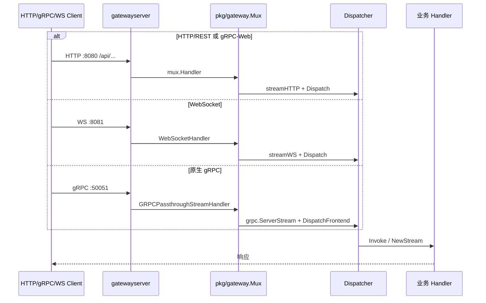
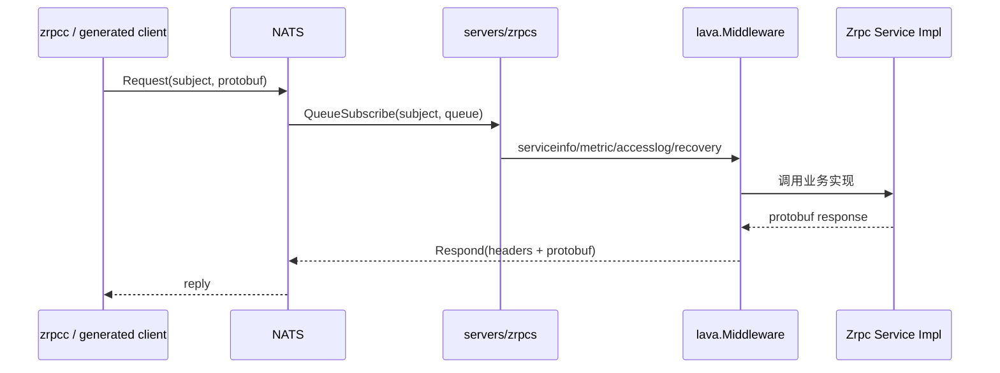
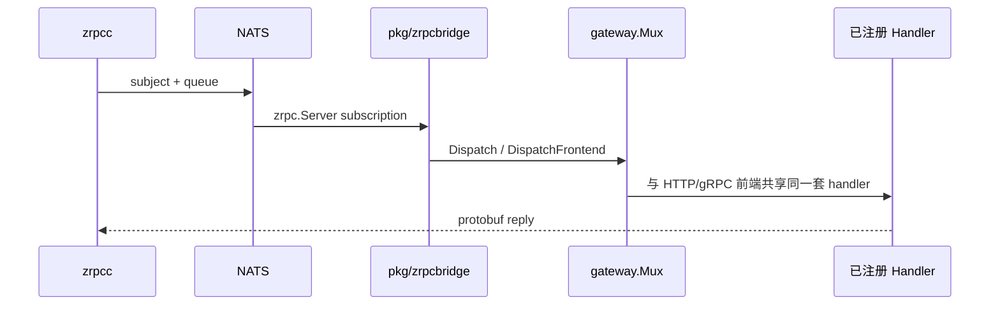
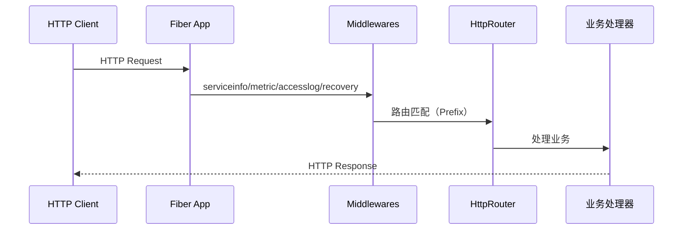
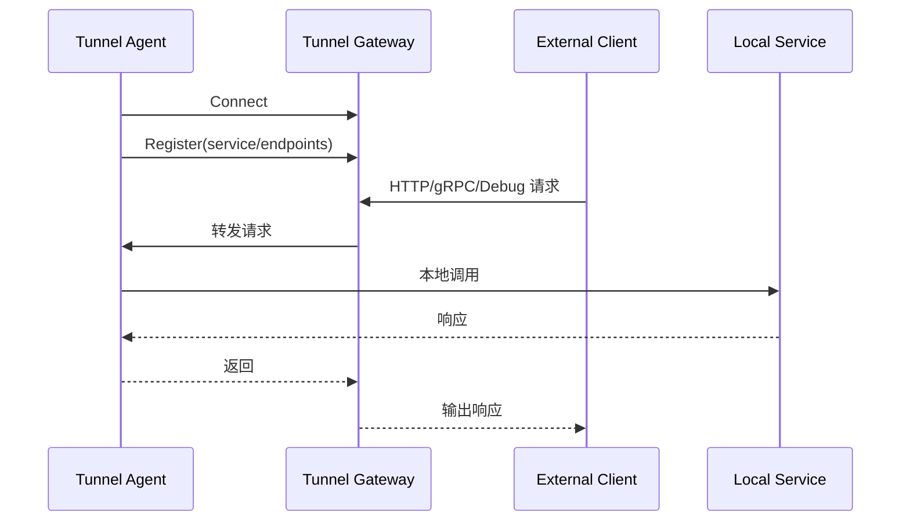

# Lava 架构文档（v2）

> 本文档描述当前仓库的实际分层、数据通路与关键运行流程，重点面向开发与维护。
> 最后更新：2026-07（`gatewayserver` 拆分、`zrpcbridge` 独立、Traefik HTTP/3）。

## 1. 分层视图



| 层 | 目录 | 职责 |
| --- | --- | --- |
| 入口 | `main.go`、`core/lavabuilder` | CLI 启动、DI 装配 |
| 命令 | `cmds/*` | `lava grpc/http/tunnel/curl/...` |
| 服务宿主 | `servers/*` | 监听端口、挂中间件、注册路由 |
| 核心 | `core/*` | 生命周期、隧道、P2P、观测、调度 |
| 基础设施 | `pkg/*` | gateway、zrpc、builder 等可复用库 |
| 部署边缘 | `deploy/traefik` | TLS / HTTP/3 终止，回源明文 |

## 2. 四条独立数据通路

以下四条通路解决不同传输场景，**不要混为一谈**。

### 通路 A：对外 API 网关（主路径）

浏览器、移动端、外部服务调用 API。

```
客户端
  → [可选] Traefik :443（HTTP/3 QUIC / HTTP/2 TLS）
  → servers/gatewayserver
       ├─ :8080  HTTP/REST + gRPC-Web（Fiber，/api 前缀）
       ├─ :8081  WebSocket（net/http，可选）
       └─ :50051 原生 gRPC（h2c 或 grpc_passthrough）
  → pkg/gateway.Mux
  → 业务 Handler（本地 inproc 或远程代理）
```

- **命令**：`lava grpc` → `gatewayserver.New`（`cmds/grpcservercmd`）
- **配置**：`gateway_server`（`gatewayserver.LoadConfig`）
- **TLS**：框架内不处理；Traefik 边缘终止，回源 `http` / `h2c`
- **调试**：`/debug/vars` 暴露 `gateway-server-info`

### 通路 B：NATS 微服务（zrpc）

进程间通过消息总线 RPC，不走 HTTP/TCP 网关。

```
zrpc Client → NATS (subject + queue) → zrpc.Server → 业务 Handler
```

| 接法 | 说明 |
| --- | --- |
| `servers/zrpcs` | 纯 NATS 微服务宿主，代码生成 `Register...ZrpcRoutes` |
| `pkg/zrpcbridge.RegisterMux` | 把已在 `gateway.Mux` 注册的 handler **额外**暴露到 NATS |

> 重构后：zrpc **不是** gateway 前端，而是可选桥接。`gateway_server.zrpc_url`（旧 `grpc_server.zrpc_url`）已移除。

### 通路 C：反向隧道（tunnel）

内网服务主动连公网 Gateway，实现 ngrok/frp 式穿透。

```
外部请求 → tunnel Gateway（公网）
              ↑ 反向长连接
         tunnel Agent（内网）→ 本地 HTTP/gRPC/debug
```

- **传输**：yamux / QUIC / KCP / P2P（ICE+QUIC）
- **命令**：`lava tunnel gateway`、`lava tunnel agent`
- 详见 `core/tunnel/doc.go`、`docs/design-v2.md`

### 通路 D：P2P 直连（core/p2p）

两端 NAT 穿透后点对点通信。

```
Peer A ←→ [ICE 信令经 tunnel gateway] ←→ Peer B
Peer A ←════ QUIC over UDP（直连或 TURN relay）════→ Peer B
```

- **信令**：tunnel gateway HTTP 路由 + token 鉴权
- **数据面**：ICE 打通 UDP → `quic-go`（复用 `core/tunnel/quic`）
- 详见 `docs/design-p2p.md`

## 3. `pkg/gateway` 内部三层

Gateway **只做协议翻译**，不负责监听端口、NATS 或 TLS。



核心抽象（`pkg/gateway/core.go`）：

```go
type FrontendStream = grpc.ServerStream   // 所有前端归一化
type Backend = grpc.ClientConnInterface  // Mux 实现 Invoke/NewStream
```

详细设计见 `pkg/gateway/docs/architecture.md`。

## 4. 启动流程

Lava 存在两套常见入口：

1. `main.go`：偏工具化 CLI（`watch` / `curl` / `tunnel` / `fileserver` / `devproxy`）
2. `core/lavabuilder.Run`：偏 DI 装配（注入 `version` / `health` / `dep` / `grpc` / `http` / `cron` / `tunnel` 等命令）



## 5. 请求路径详解

### 5.1 Gateway 服务器（`servers/gatewayserver`）



### 5.2 zrpc（`servers/zrpcs` + `clients/zrpcc`）



### 5.3 zrpcbridge（可选，复用 Gateway handler）



用法见 `pkg/zrpcbridge/README.md`。

### 5.4 HTTP 服务器（`servers/https`）



### 5.5 Tunnel 反向连接



## 6. 生产部署（Traefik + HTTP/3）

Gateway **不内置 TLS**。推荐在边缘用 Traefik 终止 TLS 并启用 HTTP/3：

```
客户端 [HTTP/3 QUIC] → Traefik :443
                         ├─ http://gateway:8080   REST + gRPC-Web
                         ├─ http://gateway:8081   WebSocket
                         └─ h2c://gateway:50051   原生 gRPC
```

- 配置：`deploy/traefik/`（`traefik.yml` 已含 `http3: {}`，需映射 UDP 443）
- Gateway 文档：`pkg/gateway/docs/deploy.md`

## 7. 模块选型速查

| 需求 | 选型 |
| --- | --- |
| 对外 REST / gRPC-Web / WS / 原生 gRPC | `servers/gatewayserver` + `pkg/gateway` |
| 只要简单 HTTP | `servers/https` |
| NATS 消息总线 RPC | `servers/zrpcs` 或 `pkg/zrpcbridge` |
| 内网穿透、远程 debug | `core/tunnel` + `lava tunnel` |
| 两端 NAT 穿透直连 | `core/p2p` |
| 生产 HTTPS / HTTP/3 | `deploy/traefik` |
| 调试路由列表 | `lava curl --list` |

## 8. 目录锚点

```
lava/
├── cmds/                 # CLI 命令
├── servers/
│   ├── gatewayserver/    # ★ 对外多协议网关
│   ├── https/            # 纯 HTTP
│   └── zrpcs/            # NATS 微服务
├── pkg/
│   ├── gateway/          # ★ 协议转换核心
│   ├── zrpc/             # NATS RPC runtime
│   └── zrpcbridge/       # Mux ↔ zrpc 桥接
├── core/
│   ├── supervisor/       # 服务生命周期
│   ├── tunnel/           # 反向隧道
│   └── p2p/              # ICE + QUIC
├── clients/              # grpcc / resty / zrpcc
└── deploy/traefik/       # HTTP/3 + TLS 边缘
```

详细模块信息见 `docs/modules/README.md`。

## 9. 近期架构变更（2026）

| 之前 | 现在 |
| --- | --- |
| `servers/grpcs` 包 | 已删除；使用 `gatewayserver` |
| `Mux.RegisterZrpc` | `pkg/zrpcbridge.RegisterMux`（DI 显式调用） |
| `gateway_server.zrpc_url`（旧 `grpc_server.zrpc_url`） | 已移除 |
| 原生 gRPC 空占位 `stream.grpc.go` | 已删除（直接用 `grpc.ServerStream`） |

设计原则：

1. **gateway = 协议转换**，不管传输总线
2. **servers = 端口监听 + 装配**，不管业务
3. **zrpc = NATS 传输**，通过 bridge 可选接入 gateway handler
4. **tunnel / p2p = 独立穿透/直连通路**，与 gatewayserver 并列
5. **TLS / HTTP/3 = 边缘代理**，不进框架
