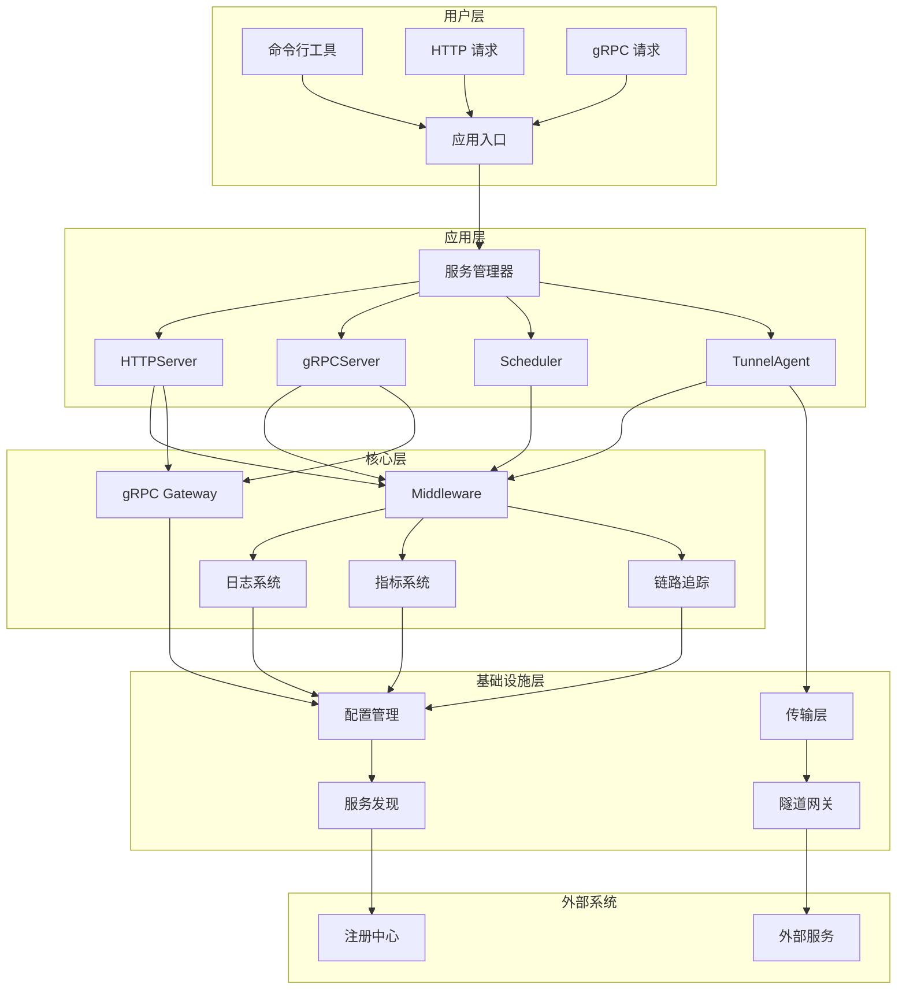
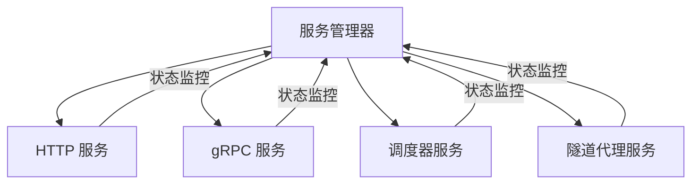
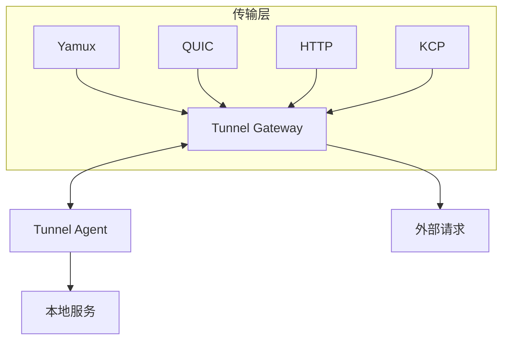
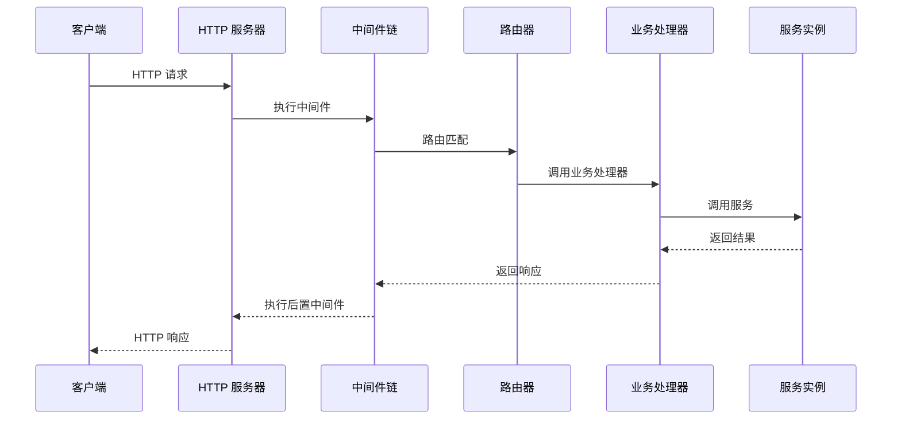
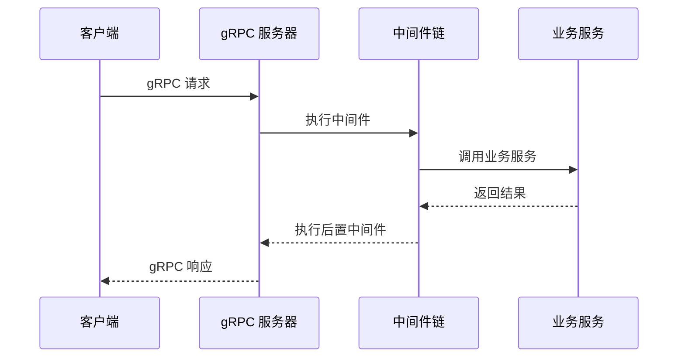
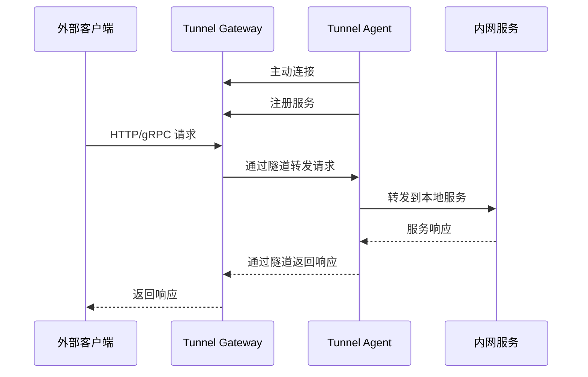
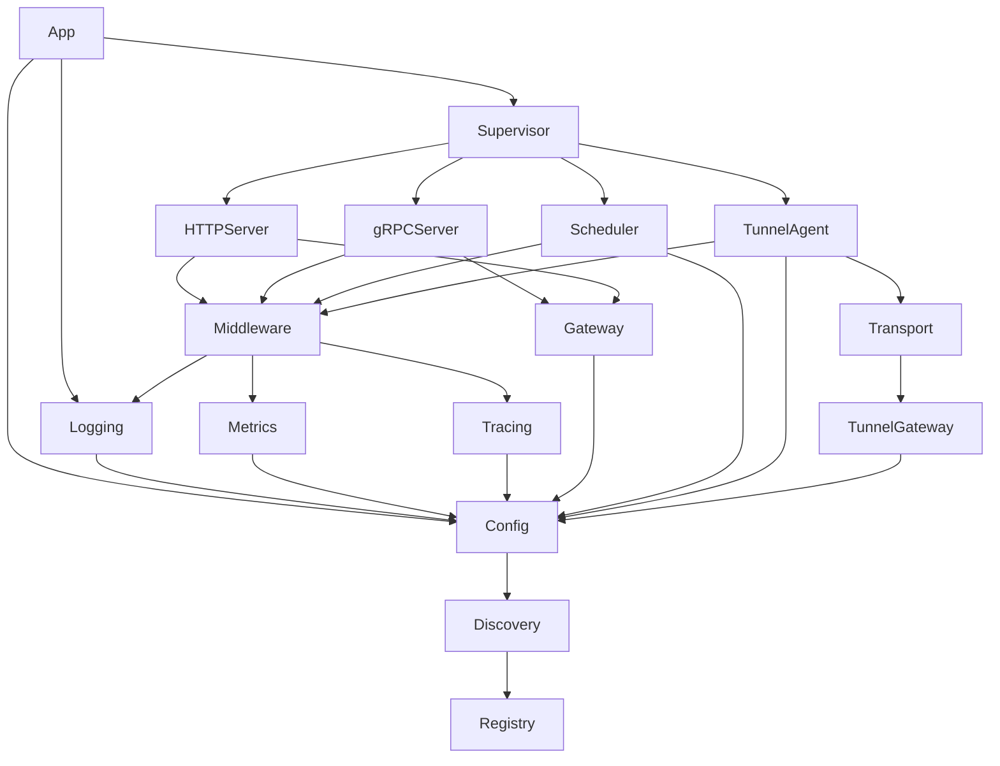
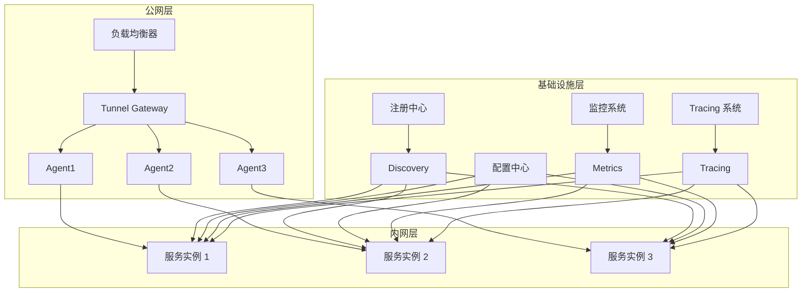

# Lava 架构文档

## 1. 项目概述

Lava 是一个经过企业实践抽象出来的微服务中台集成框架，提供了一套完整的微服务开发和运行体系。

### 核心价值

- **配置驱动开发**：统一的配置管理，支持本地配置和配置中心
- **对象管理**：基于依赖注入框架 dix 管理对象生命周期
- **Runtime 抽象**：统一的服务入口，支持 CLI、HTTP、gRPC 等多种服务类型
- **插件化架构**：通过插件机制管理所有资源
- **便捷的 Protobuf 管理**：集成 protoc 命令管理依赖和编译
- **调试友好**：丰富的 debug API 和详细的系统日志
- **自动生成文档**：支持 Swagger 和 HTTP REST Client 文档生成
- **可观测性**：内置 Tracing 和 Metric 集成
- **统一的中间件**：HTTP 和 gRPC 共享同一套中间件抽象
- **统一的服务定义**：通过 Protobuf 定义 gRPC 和 HTTP 服务

## 2. 整体架构

### 2.1 架构图



### 2.2 分层说明

| 层级 | 说明 | 主要组件 |
|------|------|----------|
| 用户层 | 与用户交互的入口 | 命令行工具、HTTP/gRPC 客户端 |
| 应用层 | 应用核心逻辑 | 服务管理器、各种服务实现 |
| 核心层 | 核心功能模块 | 中间件、日志、指标、追踪 |
| 基础设施层 | 底层支持 | 配置管理、服务发现、传输层 |
| 外部系统 | 外部依赖 | 注册中心、外部服务 |

## 3. 核心模块架构

### 3.1 服务管理器 (Supervisor)

服务管理器是 Lava 的核心组件，负责管理所有服务的生命周期。



**核心功能**：
- 服务注册和管理
- 生命周期控制（启动、停止、重启）
- 健康状态监控
- 自动故障恢复
- 调试 API 接口

### 3.2 HTTP 服务器 (HTTPServer)

基于 Fiber 框架实现的 HTTP 服务器。

**核心组件**：
- Fiber 应用实例
- 路由管理
- 中间件链
- Debug API

### 3.3 gRPC 服务器 (gRPCServer)

基于标准 gRPC 库实现的 gRPC 服务器。

**核心组件**：
- gRPC 服务器实例
- 服务注册
- 中间件链
- gRPC Gateway（HTTP/JSON 转换）

### 3.4 调度器 (Scheduler)

基于 cron 表达式的任务调度系统。

**核心功能**：
- 任务注册和管理
- 基于 cron 表达式的调度
- 任务执行和监控
- 调试 API

### 3.5 隧道系统 (Tunnel)

基于反向连接的服务代理网关系统。



**核心功能**：
- 反向连接（Agent 主动连接 Gateway）
- 内网穿透
- 服务聚合
- 远程调试
- 多种传输协议支持（Yamux、QUIC、HTTP、KCP）

### 3.6 中间件系统 (Middleware)

统一的中间件抽象，支持 HTTP 和 gRPC。

**内置中间件**：
- 访问日志（AccessLog）
- 指标收集（Metric）
- 异常恢复（Recovery）
- 服务信息（ServiceInfo）

### 3.7 可观测性系统

**日志系统 (Logging)**：
- 支持多种日志输出（slog、stdlog、grpclog）
- 结构化日志
- 日志级别管理

**指标系统 (Metrics)**：
- Prometheus 集成
- 统一的指标注册
- 服务级别和方法级别的指标

**链路追踪 (Tracing)**：
- OpenTelemetry 集成
- 通过 reqId 打通业务日志和追踪日志
- 支持多种导出器

### 3.8 配置系统 (Config)

**核心功能**：
- 配置驱动开发
- 本地配置和配置中心支持
- 配置变更管理
- 配置热更新

### 3.9 服务发现 (Discovery)

**核心功能**：
- 支持多种注册中心
- 服务实例管理
- 健康检查

### 3.10 gRPC Gateway

**核心功能**：
- HTTP/JSON 到 gRPC 的协议转换
- 支持 Google API HTTP 注解
- gRPC Web 支持
- 服务注册和路由

## 4. 数据流和调用关系

### 4.1 HTTP 请求处理流程



### 4.2 gRPC 请求处理流程



### 4.3 Tunnel 工作流程



## 5. 核心 API 和接口

### 5.1 服务接口

```go
// Service 定义服务接口
type Service interface {
    String() string
    Serve(ctx context.Context) error
}

// HttpRouter 定义 HTTP 路由接口
type HttpRouter interface {
    Router(router any)
    Prefix() string
    Middlewares() []Middleware
}

// GrpcRouter 定义 gRPC 路由接口
type GrpcRouter interface {
    ServiceDesc() *grpc.ServiceDesc
}

// GrpcHttpRouter 定义同时支持 gRPC 和 HTTP 的路由接口
type GrpcHttpRouter interface {
    HttpRouter
    GrpcRouter
}
```

### 5.2 中间件接口

```go
// Middleware 定义中间件接口
type Middleware interface {
    Handle(ctx context.Context, req interface{}) (interface{}, error)
}
```

### 5.3 隧道接口

```go
// Transport 定义传输层接口
type Transport interface {
    Name() string
    Dial(ctx context.Context, addr string) (Session, error)
    Listen(ctx context.Context, addr string) (Listener, error)
}

// Agent 定义代理客户端接口
type Agent interface {
    Start(ctx context.Context) error
    Stop(ctx context.Context) error
    Register(ctx context.Context, service *ServiceInfo) error
    Deregister(ctx context.Context, serviceName string) error
    Status() AgentStatus
}

// Gateway 定义网关接口
type Gateway interface {
    Start(ctx context.Context) error
    Stop(ctx context.Context) error
    Services() []*ServiceInfo
    GetService(name string) (*ServiceInfo, error)
    Status() GatewayStatus
    Forward(ctx context.Context, serviceName string, endpointType EndpointType, conn net.Conn) error
}
```

## 6. 依赖关系

### 6.1 核心依赖

| 依赖 | 版本 | 用途 |
|------|------|------|
| github.com/gofiber/fiber/v3 | v3.0.0 | HTTP 服务器框架 |
| google.golang.org/grpc | v1.78.0 | gRPC 框架 |
| go.opentelemetry.io/otel | v1.39.0 | 链路追踪 |
| github.com/prometheus/client_golang | v1.22.0 | 指标收集 |
| github.com/pubgo/dix/v2 | v2.0.0-beta.12 | 依赖注入框架 |
| github.com/pubgo/funk/v2 | v2.0.0-beta.17 | 工具库 |
| github.com/reugn/go-quartz | v0.15.1 | 调度器 |
| github.com/libp2p/go-yamux/v5 | v5.1.0 | 传输层多路复用 |
| github.com/quic-go/quic-go | v0.59.0 | QUIC 传输协议 |
| github.com/xtaci/kcp-go/v5 | v5.6.64 | KCP 传输协议 |

### 6.2 模块依赖关系



## 7. 部署架构

### 7.1 典型部署方案



### 7.2 服务编排

- **Kubernetes**：推荐的容器编排平台
- **Docker Compose**：适用于开发和测试环境
- **Systemd**：适用于物理机和虚拟机部署

## 8. 扩展和定制

### 8.1 扩展点

1. **中间件扩展**：实现统一的中间件接口
2. **传输协议扩展**：实现 Tunnel 的 Transport 接口
3. **服务发现扩展**：实现 Discovery 接口
4. **日志系统扩展**：实现自定义日志输出
5. **指标系统扩展**：实现自定义指标导出
6. **配置中心扩展**：实现自定义配置源

### 8.2 定制化开发

1. **服务定制**：继承现有服务实现，重写特定方法
2. **配置定制**：通过配置文件定制服务行为
3. **中间件定制**：开发业务特定的中间件
4. **命令行工具定制**：扩展现有命令或开发新命令

## 9. 性能优化

### 9.1 最佳实践

1. **连接池管理**：合理配置 HTTP 和 gRPC 连接池
2. **缓存策略**：对频繁访问的数据使用缓存
3. **异步处理**：对耗时操作使用异步处理
4. **批量操作**：减少网络往返，使用批量 API
5. **压缩传输**：启用 HTTP 和 gRPC 的压缩
6. **合理的超时设置**：避免长连接占用资源

### 9.2 监控指标

**关键指标**：
- 请求延迟（P50、P90、P99）
- QPS（每秒查询数）
- 错误率
- 资源使用率（CPU、内存、网络）
- 连接数

## 10. 总结

Lava 提供了一套完整的微服务开发和运行体系，通过统一的抽象和插件化架构，大大简化了微服务的开发和运维。其核心价值在于：

1. **统一的开发体验**：一套代码，多种运行方式
2. **完善的可观测性**：内置日志、指标和追踪
3. **强大的扩展性**：插件化架构，易于扩展
4. **企业级可靠性**：经过实践验证的稳定性
5. **开发效率提升**：配置驱动开发，减少重复代码

Lava 不仅是一个框架，更是一套完整的微服务开发方法论，帮助开发者专注于业务逻辑的实现，而将基础设施的复杂性交给框架处理。