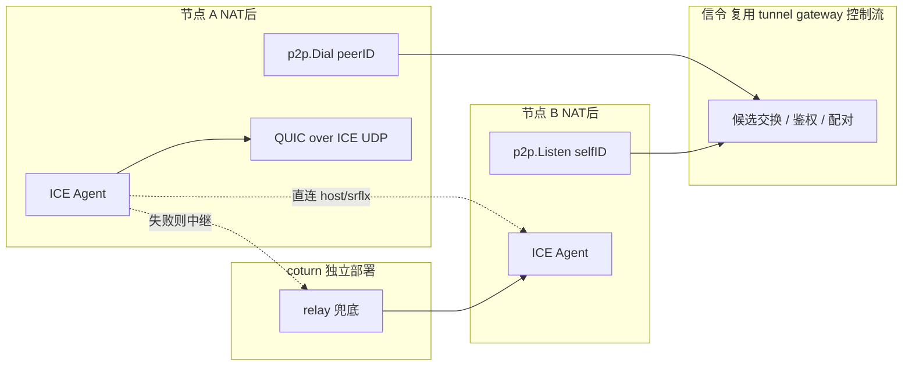
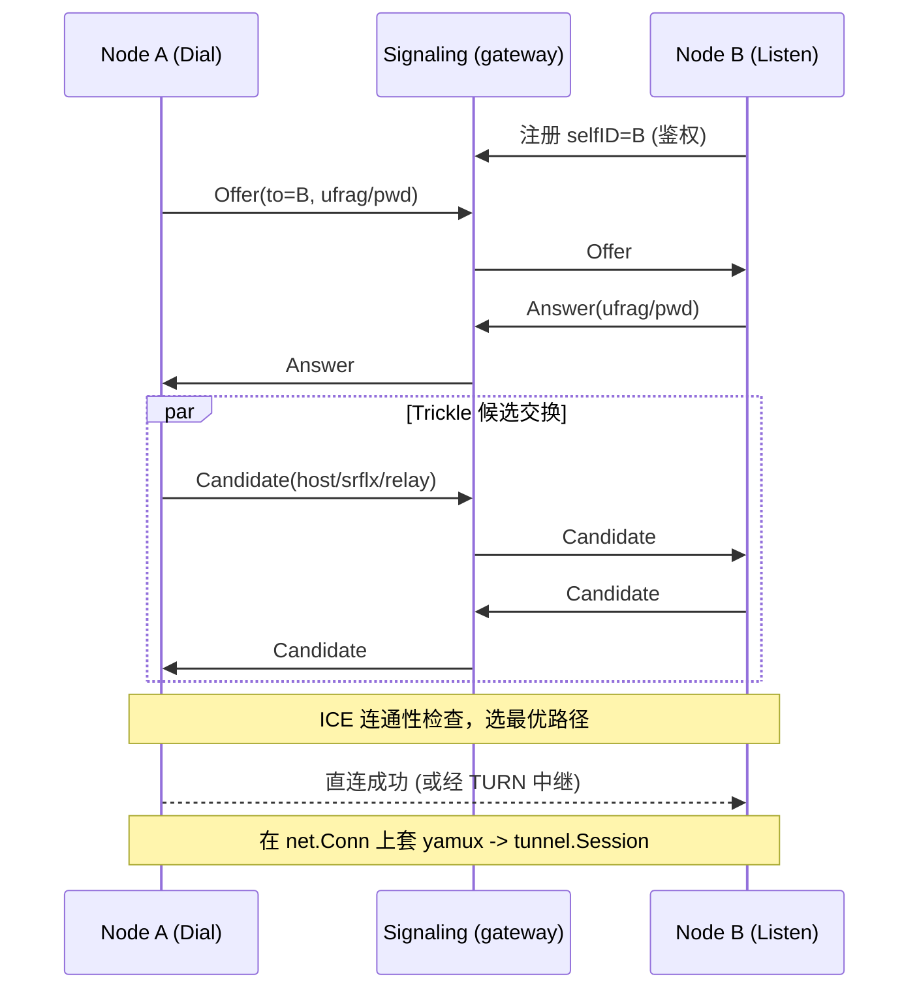

# Core P2P 模块设计文档（草案 / 待评审）

> 目标：在 lava 中新增 `core/p2p` 模块，集成 STUN / TURN / ICE，实现 NAT 穿透的点对点通信，
> 并复用现有 `core/tunnel` 的多路复用、鉴权与可观测能力。
>
> 状态：**P1–P6 已实现并通过测试**（信令 / ICE / STUN / TURN 客户端 / QUIC over ICE / tunnel transport / DI 装配 / CLI）。
> 对称 NAT 实网穿透率仍需多环境实测验证。

## 0.1 基础设施（dev）

| 项 | 值 |
| --- | --- |
| 主机 | `dev` → `118.178.168.253`（`~/.ssh/config`） |
| STUN/TURN | `118.178.168.253:3478` |
| Relay 端口 | `10000-20000` |
| 凭证 | `lava` / `lava-p2p-dev`（realm `lava.dev`） |
| 部署 | `deploy/coturn/` + `ssh dev bash /tmp/lava-coturn/install.sh` |

## 0.2 实现进度（2026-06-27）

| 阶段 | 状态 | 关键代码 |
| --- | --- | --- |
| P0 coturn | ✅ dev 已部署 | `deploy/coturn/` |
| P1 tunnel 信令 | ✅ Offer/Answer/Candidate 经 gateway 路由 + token 鉴权 | `signaling/tunnelsig/`、`tunnelgateway/impl.go` |
| P2 信令类型 + memory broker | ✅ | `core/p2p/signaling/` |
| P2/P3 ICE host + STUN | ✅ host 直连 + srflx 候选，trickle | `core/p2p/ice/connect.go` |
| P4 TURN 客户端 | ✅ 外部 coturn relay 候选（dev STUN 集成测试） | `core/p2p/ice/connect.go` |
| P5 QUIC over ICE UDP | ✅ ICE `net.PacketConn` 适配 + QUIC 承载，注册为 tunnel transport，`/debug/p2p` | `coordinator.go`、`quicconn/`、`transport/`、`p2pdebug/` |
| P6 集成 | ✅ DI 装配（`p2pbuilder`）+ `lava tunnel agent` CLI + 环境变量配置 | `p2pbuilder/`、`cmds/tunnelcmd/agent.go`、`config_env.go` |

测试：`core/p2p/...` 全量通过（含 `TestCoordinatorP2QUIC`、`TestP2PEndToEndViaTunnel` 经 gateway+agent 全链路，`-count=5` 稳定）。


1. **信令通道**：复用现有 tunnel gateway 的控制流承载信令，不另起独立信令服务。
2. **Transport 抽象**：统一复用 tunnel 的 `Transport` 接口，不新增独立 `P2PTransport`；
   `addr` 在 P2P 语义下解释为 `peerID`。
3. **加密 / 可靠化 / 多路复用**：在 ICE 打通的 UDP 路径上**铺 QUIC**。
   QUIC 一层同时提供「可靠有序 + 多路复用 + 内置 TLS 1.3」，即用应用自己的 TLS，
   **无需 DTLS、无需 SCTP、无需额外 yamux 层**。lava 已有 `core/tunnel/quic` 可复用。
4. **TURN**：在服务器部署 **coturn**（独立进程），P2P 模块仅作为 TURN **客户端**接入，
   不在进程内自建 TURN 服务端。
5. **范围**：只做 P2P 数据传输，不引入 WebRTC 的媒体 / DataChannel / 信令 SDP 全集。

### 关于 #3 的说明：为什么是 QUIC 而不是 DTLS 或普通 TLS

- 普通 **TLS** 与 **yamux** 都要求**可靠有序的字节流**（TCP 语义）。
- ICE 打通的是一条 **UDP 路径**（TURN 中继同样是 UDP），不可靠、无序。
- 因此普通 TLS/yamux **不能直接**铺在 ICE 之上，中间必须先有「可靠化」层。
- **DTLS** 是 TLS 的 UDP 版（只解决加密，不解决可靠/多路），WebRTC 用它 + SCTP 才凑齐。
- **QUIC**（基于 UDP）一层即同时给出可靠、有序、多路复用、TLS 1.3，最契合本项目约束，故选 QUIC。

## 1. 设计目标与非目标

### 目标
1. 让两个位于 NAT 后的节点建立**直连**（尽量），失败时通过 **TURN 中继**兜底。
2. 复用 tunnel 的 `Session` / `Stream` 多路复用抽象，P2P 链路建立后即可承载多路业务流。
3. 复用 lava 既有基建：DI（dix）、生命周期（lifecycle）、鉴权（`TokenAuthProvider`）、调试端点（`/debug`）、限流（`RateLimiter`）。
4. 把 P2P 暴露为 tunnel 框架的一种 `Transport`，与 yamux / quic / kcp 平级。

### 非目标（首版不做）
- 不做完整 WebRTC（DataChannel / 媒体），只做数据面连接。
- 不做多人 mesh 路由 / DHT 发现，节点通过显式 `peerID` + 信令服务寻址。
- 不自研 STUN/TURN/ICE 协议栈，直接采用 pion 生态。

## 2. 协议分工

| 协议 | 作用 | 部署 |
| --- | --- | --- |
| STUN | 获取节点公网映射地址（server-reflexive 候选） | 自建或公共服务，开销小 |
| TURN | 直连失败时中继流量（relay 候选） | **部署 coturn**，需公网 IP + 带宽 |
| ICE | 收集候选（host/srflx/relay）、连通性检查、选最优路径 | 客户端逻辑 |

关键点：**对称 NAT 必然打洞失败，TURN 是可靠性保底，不可省略。**

## 3. 技术选型

采用 [pion](https://github.com/pion) 生态（Go WebRTC 事实标准）做 NAT 穿透，QUIC 做承载：

- `pion/stun` — STUN 消息与客户端（收集 srflx 候选）
- `pion/turn` — 仅用其 **TURN 客户端**接入外部 coturn（不使用其服务端）
- `pion/ice` — 完整 ICE agent，协商成功后产出 UDP 链路（`net.Conn` / `net.PacketConn`）
- `quic-go` — 在 ICE 链路上承载 QUIC（复用 `core/tunnel/quic`），提供可靠 + 多路 + TLS

> 不使用 `pion/dtls`、`pion/sctp`、`pion/webrtc`：可靠化/多路/加密统一交给 QUIC。
> 版本通过 `go get` 拉取最新稳定版，不在文档固化版本号。

## 4. 总体架构



设计核心：**ICE 打通 UDP 路径后，在其上铺 QUIC**；QUIC 自带可靠+多路+TLS，
其多路 stream 直接适配 `tunnel.Session` / `tunnel.Stream`。于是「P2P」对上层就是「另一种 transport」。

## 5. 目录结构（实际实现）

```
core/p2p/
  aaa.go              # 核心接口与类型（Coordinator、Listener、PeerConn、Stats）
  config.go           # STUN/coturn 默认值、ICE 超时、TransportOptions 转换
  config_env.go       # ConfigFromEnv / PeerIDFromEnv / AuthTokenFromEnv
  coordinator.go      # Dial/Listen 编排：ICE → QUIC，连接跟踪与 Stats
  ice_config.go       # p2p.Config ↔ ice.Config 转换
  errors.go           # sentinel errors
  signaling/
    signaling.go      # Broker 抽象 + Message 类型（Offer/Answer/Candidate）
    memory.go         # 内存 Broker（单测/PoC）
    tunnelsig/        # 经 tunnel gateway 控制流的 Broker 实现
  ice/
    connect.go        # pion/ice 封装：trickle 协商，返回 *Connection
    packetconn.go     # ICE Conn → net.PacketConn 适配（供 QUIC 使用）
    config.go         # ICE 独立配置（避免 import cycle）
  quicconn/
    quicconn.go       # QUIC Dial/Listen + TLS 配置
    tunnel.go         # QUIC Conn → tunnel.Session 包装；DialSession/AcceptOne
  transport/
    transport.go      # 注册 tunnel.TransportP2P（addr 语义 = peerID）
  p2pbuilder/
    builder.go        # DI 装配：tunnel agent 信令 + lifecycle + debug 钩子
  p2pdebug/
    debug.go          # /debug/p2p：self_id、listening、活跃连接选路
```

> TURN 服务端由外部 coturn 提供，本模块不含 `turnserver/`，仅在 `ice/` 内做 TURN 客户端接入。

## 6. 核心接口（草案）

```go
// Coordinator 管理本节点的 P2P 能力：注册自身、向对端发起连接。
type Coordinator interface {
    // Listen 向信令注册自身 ID，开始接受对端发起的连接。
    Listen(ctx context.Context, selfID string) (Listener, error)
    // Dial 向指定 peerID 发起 P2P 连接（内部完成信令交换 + ICE 建连）。
    Dial(ctx context.Context, peerID string) (PeerConn, error)
    Close() error
}

// PeerConn 是一条已建立的 P2P 连接，套 yamux 后即为 tunnel.Session。
type PeerConn interface {
    tunnel.Session              // 复用多路复用抽象
    RemotePeerID() string
    SelectedCandidate() CandidatePair  // host/srflx/relay + RTT，用于可观测
}

// Signaling 抽象带外信令通道（候选/Offer/Answer 交换）。
type Signaling interface {
    Send(ctx context.Context, to string, msg SignalMessage) error
    Recv(ctx context.Context) (SignalMessage, error)
    Close() error
}
```

> `Transport` 适配：tunnel 现有 `Transport.Dial(ctx, addr)` 中的 `addr` 在 P2P 语义下
> 解释为 `peerID`。这是唯一需要小幅扩展现有抽象的地方，评审时重点确认。

## 7. 信令消息格式（草案）

信令走 JSON（与 tunnel `Message` 一致的风格），通过 tunnel 控制流或独立 WebSocket/gRPC stream 传输：

```go
type SignalType uint8

const (
    SignalOffer     SignalType = iota + 1 // 发起方 ICE 参数
    SignalAnswer                          // 应答方 ICE 参数
    SignalCandidate                       // trickle ICE 候选
    SignalBye                             // 结束/失败
)

type SignalMessage struct {
    Type      SignalType `json:"type"`
    From      string     `json:"from"`
    To        string     `json:"to"`
    Ufrag     string     `json:"ufrag,omitempty"`     // ICE username fragment
    Pwd       string     `json:"pwd,omitempty"`       // ICE password
    Candidate string     `json:"candidate,omitempty"` // SDP candidate 行
    AuthToken string     `json:"auth_token,omitempty"`// 复用 TokenAuthProvider
}
```

要点：
- 支持 **trickle ICE**（边收集边发候选），降低首次建连延迟。
- 鉴权复用 `tunnel.TokenAuthProvider`，信令服务校验 `auth_token`。

## 8. 连接建立时序



## 9. 安全设计

- **传输加密**：由 **QUIC 内置的 TLS 1.3** 提供，无需 DTLS，也无需单独的 yamux+TLS 组合。
  证书/校验复用 tunnel 已有的 TLS 配置体系（`TransportOptions` / `MergeTransportOptions`）。
- **信令鉴权**：复用 `TokenAuthProvider`，拒绝未授权节点注册/发起连接。
- **TURN 凭证**：使用 coturn 的 long-term credential（用户名/密码或基于时间的 HMAC 临时凭证）。

## 10. 可观测性

`/debug/p2p` 必须暴露（线上排查穿透问题的关键）：
- 每条连接的**选路结果**：host / srflx / relay？
- 候选收集耗时、ICE 状态机状态、RTT。
- TURN 中继连接数与带宽（接入 `core/metrics`）。
- 复用 tunnel 的 `RateLimiter` 对信令与中继做限流。

## 11. 分阶段落地计划

| 阶段 | 内容 | 验收标准 | 状态 |
| --- | --- | --- | --- |
| P1 信令 | 定义 `SignalMessage`，基于 tunnel 控制流跑通双向交换 + 鉴权 | 两节点能互发 Offer/Answer/Candidate | ✅ |
| P2 STUN+打洞 | 仅 host/srflx 候选，对简单 NAT 直连 | Full Cone/Restricted NAT 下直连成功 | ✅ |
| P3 ICE | 用 `pion/ice` 状态机替换手写打洞 | 打通稳定 UDP 链路，含连通性检查 | ✅ |
| P4 TURN | 接入外部 coturn + relay 候选 | 对称 NAT 下经中继可通 | ✅（dev STUN/TURN 集成测试） |
| P5 集成 | 在 ICE 链路上铺 QUIC，注册为 tunnel transport，接入 `/debug/p2p` | P2P 链路可承载多路 stream，debug 可见选路 | ✅ |
| P6 装配 | DI（`p2pbuilder`）+ `lava tunnel agent` CLI + 环境变量配置 | agent 启动即注册信令、Listen，debug 可见 | ✅ |

## 11.1 使用方式

### CLI

```bash
# 1) 启动 Gateway（信令中转）
TUNNEL_AUTH_TOKEN=secret lava tunnel gateway

# 2) 启动 Agent 并启用 P2P（设置 P2P_PEER_ID 即开启）
TUNNEL_GATEWAY_ADDR=localhost:7007 \
TUNNEL_AUTH_TOKEN=secret \
P2P_PEER_ID=node-a \
P2P_INSECURE=true \
lava tunnel agent
```

管理界面默认 `:6067`，P2P 状态见 `http://localhost:6067/debug/p2p`。

### 环境变量

| 变量 | 说明 |
| --- | --- |
| `P2P_PEER_ID` | 节点 ID；**设置后才启用 P2P** |
| `P2P_STUN_URLS` | 逗号分隔 STUN URL（默认 dev coturn） |
| `P2P_TURN_URL` / `P2P_TURN_USER` / `P2P_TURN_PASS` | TURN 客户端配置 |
| `P2P_ICE_TIMEOUT` | ICE 超时，如 `30s` |
| `P2P_INSECURE` | `true`/`1` 跳过 QUIC TLS 校验（**仅开发**） |
| `P2P_AUTH_TOKEN` | 信令鉴权 token（缺省回落到 `TUNNEL_AUTH_TOKEN`） |

### 代码装配（DI）

```go
coord, err := p2pbuilder.New(p2pbuilder.Params{
    LC:            lc,            // lifecycle.Lifecycle
    Agent:         tunnelAgent,   // 已连接 gateway 的 tunnel agent
    PeerID:        "node-a",
    ListenOnStart: true,          // AfterStart 自动 Listen 接受入站
    Config:        &p2p.Config{AuthToken: token, Insecure: true},
})
// AfterStart 后：
peer, _ := coord.Dial(ctx, "node-b") // peer 实现 tunnel.Session
stream, _ := peer.Open(ctx)
```

> 说明：同一 `Coordinator` 当前不应同时主动 `Dial` 又自动 `Listen`，
> 否则两个 ICE 接收循环会争抢同一 broker 的信令。
> 主动拨号节点请置 `ListenOnStart: false`；纯被动接受节点置 `true`。

## 12. 风险与注意事项

- **信令可靠性**：需支持 ICE restart 与 trickle，否则建连慢且脆。
- **TURN 成本**：中继走带宽、开大量端口，生产需限流与容量规划。
- **对称 NAT**：不要指望纯 STUN，必须有 TURN。
- **NAT 类型多样性**：建议早期就准备多环境实测（不同运营商/NAT 类型）穿透率。
- **接口侵入**：把 `addr` 复用为 `peerID` 会影响 tunnel `Transport` 语义，需评审确认是否新增独立接口而非复用。

## 13. 决策点（已定稿，见第 0 节）

1. 信令通道：✅ 复用 tunnel gateway 控制流。
2. `Transport` 抽象：✅ 统一复用 tunnel `Transport`，`addr` 解释为 `peerID`。
3. 加密 / 可靠 / 多路：✅ ICE 链路上铺 QUIC（内置 TLS 1.3），不用 DTLS / SCTP / yamux。
4. TURN：✅ 外部 coturn，模块只做 TURN 客户端。
5. 范围：✅ 仅 P2P 数据传输，不引入 WebRTC 媒体 / DataChannel。

### 实现期已确认的细节
- **ICE → QUIC 接法**：`pion/ice` 的 `*ice.Conn` 不能直接作 `net.PacketConn`，
  已在 `ice/packetconn.go` 包一层适配（固定对端地址的数据报通道），再交给 `quic-go` 的 `Transport`。
- **coturn 凭证**：当前为静态配置（环境变量 / `Config`）。动态临时凭证（HMAC）留待后续。

## 14. 待办（已知缺口）

- [ ] 同一 `Coordinator` 同时支持主动 Dial 与被动 Listen（共享单个 broker recv 或暂停 acceptLoop）。
- [ ] `/debug/p2p` 展示候选收集耗时、ICE 状态机状态、RTT；gateway 侧展示已注册 peer 列表。
- [ ] Metrics：选路类型（host/srflx/relay）、建连耗时、TURN 中继连接数接入 `core/metrics`。
- [ ] 信令限流：复用 tunnel `RateLimiter` 对注册/信令做限流。
- [ ] coturn 动态临时凭证（基于时间的 HMAC）。
- [ ] 多运营商 / 多 NAT 类型实网穿透率实测。
