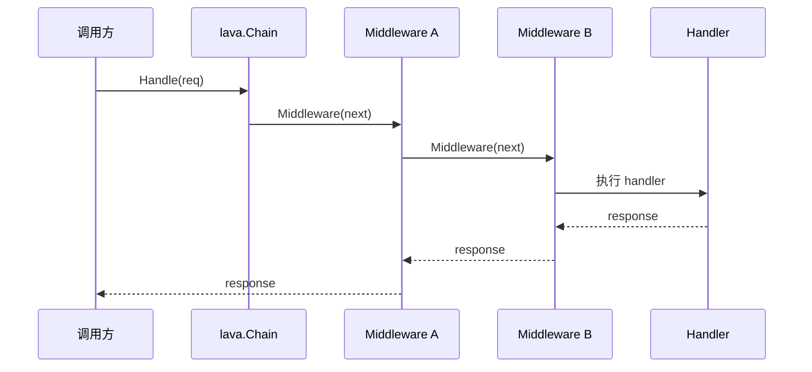
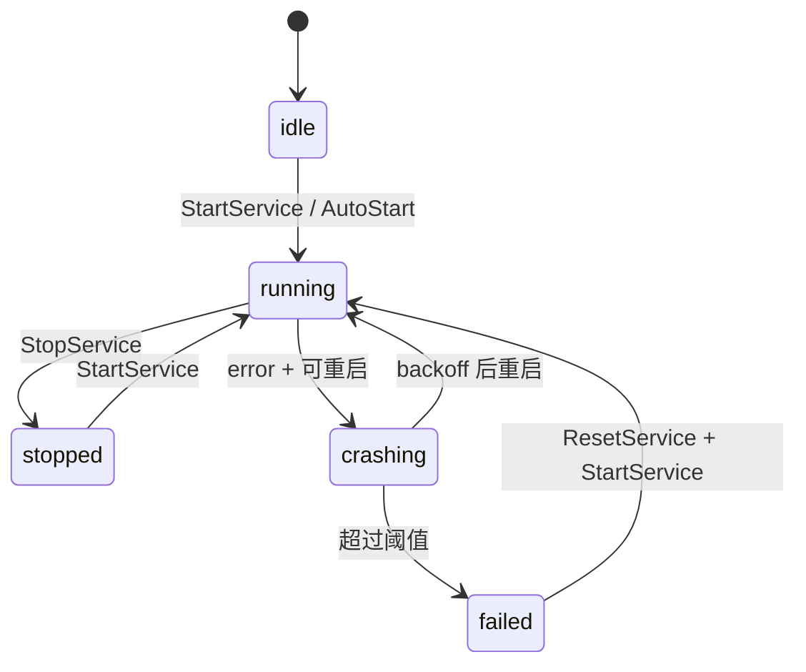

# Lava 设计文档（v2）

## 1. 设计目标

Lava 在设计上聚焦三件事：

1. **统一抽象**：命令、服务、路由、中间件使用统一接口语义。
2. **可运维**：默认带调试、日志、指标、生命周期管理能力。
3. **可扩展**：通过 `core/*` 与 `pkg/*` 的分层，把业务与基础设施解耦。

当前在传输层上，Lava 已覆盖：

- HTTP（`servers/https` / `clients/resty`）
- gRPC Gateway（`servers/gatewayserver` / `pkg/gateway`）
- zrpc（`servers/zrpcs` / `clients/zrpcc`，protobuf unary over NATS）

## 2. 核心抽象

### 2.1 中间件抽象（`lava/middleware.go`）

```go
type HandlerFunc func(ctx context.Context, req Request) (Response, error)

type Middleware interface {
    String() string
    Middleware(next HandlerFunc) HandlerFunc
}
```

这是一种“函数包裹函数”的链式模型，支持同一语义在 HTTP/gRPC/Client 场景复用。

### 2.2 路由抽象（`lava/router.go`）

```go
type HttpRouter interface {
    Middlewares() []Middleware
    Router(router fiber.Router)
    Prefix() string
}

type GrpcRouter interface {
    Middlewares() []Middleware
    ServiceDesc() *grpc.ServiceDesc
}
```

设计价值：HTTP 与 gRPC 路由都具备“挂载 + 中间件 + 前缀/描述”统一风格。

### 2.3 服务抽象（`core/supervisor/types.go`）

```go
type Service interface {
    Name() string
    Error() error
    String() string
    Serve(ctx context.Context) error
    Metric() *Metric
}
```

`supervisor.Manager` 基于该接口实现生命周期托管、重启策略和状态观测。

### 2.4 统一请求抽象（`lava/request.go` / `lava/response.go`）

当前 `lava.RequestKind` 已覆盖：

- `http`
- `grpc`
- `zrpc`

这意味着同一套 `lava.Middleware` 可以同时复用在：

- HTTP server / client
- gRPC server / client
- zrpc server / client

这也是 `zrpc` 能快速接入现有 accesslog / metric / recovery 能力的关键。

## 3. 关键设计决策

### 3.1 Supervisor 负责“稳态运行”

- 支持重启策略：`RestartAlways` / `RestartOnFailure` / `RestartNever`
- 支持窗口限流：`RestartWindow` + `MaxRestartsInWindow`
- 支持退避：`RestartDelay` -> `MaxRestartDelay`（按倍率增长）

可用近似表达：

$$
delay_{n+1}=\min(delay_n\times backoff,\ maxDelay)
$$

### 3.2 Gateway 与 gRPC 服务同源注册

`servers/gatewayserver` 装配 `pkg/gateway.Mux`，将同一套 `ServiceDesc` 暴露为 HTTP/REST、gRPC-Web、WebSocket 与原生 gRPC（可选 `grpc_passthrough`）。这使多种前端协议共享同一套 handler，减少重复维护。

NATS/zrpc 不属于 gateway 前端；若需把 Mux handler 额外暴露到 NATS，在 DI 中调用 `pkg/zrpcbridge.RegisterMux`。

### 3.3 Debug 能力内建

- `servers/https` 与 `servers/gatewayserver` 默认挂载 `/debug`
- `vars.Register(...)` 暴露配置、路由、服务信息

### 3.4 zrpc 作为内部 RPC 通道

`zrpc` 的设计定位是：

- 使用 protobuf 作为消息编码
- 使用 NATS request-reply 作为传输
- 复用 `lava.Middleware` 和 `supervisor.Service`

其价值不在于替代 gRPC，而在于提供一条更轻量的内部 RPC 通道，适合：

- 服务间内部调用
- 事件总线旁路 RPC
- 不需要 HTTP/2 / Gateway 的场景

对应实现路径：

- runtime：`pkg/zrpc`
- server host：`servers/zrpcs`
- client：`clients/zrpcc`
- proto codegen：`tools/protoc-gen-zrpc-go` + `internal/zrpcgen`

## 4. 中间件执行流程



## 5. 服务重启状态机（简化）



## 6. CLI 设计要点

- 根入口 `main.go` 偏开发工具集（watch/curl/tunnel/fileserver/devproxy）
- `core/lavabuilder.Run` 偏 DI 装配入口（更多服务型命令）

因此文档需要明确“入口上下文”，避免命令清单混淆。

## 7. 文档与实现的一致性建议

1. 命令文档以 `main.go` 作为根入口真值。
2. 接口文档优先引用 `lava/*.go` 与 `core/supervisor/types.go`。
3. 流程图更新时，必须同步标注对应实现路径。
