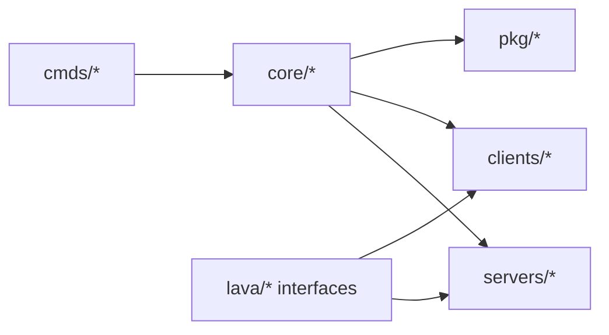

# 模块文档总览

本文档按目录组织 Lava 的模块职责，帮助你快速定位代码入口。

## 分册导航

- `core.md`：核心能力模块
- `servers.md`：服务端实现模块
- `clients.md`：客户端模块
- `pkg.md`：公共组件模块
- `cmds.md`：命令模块（含已接入/未接入）
- `lava.md`：接口抽象层
- `internal.md`：内部实现层

## 目录关系图

