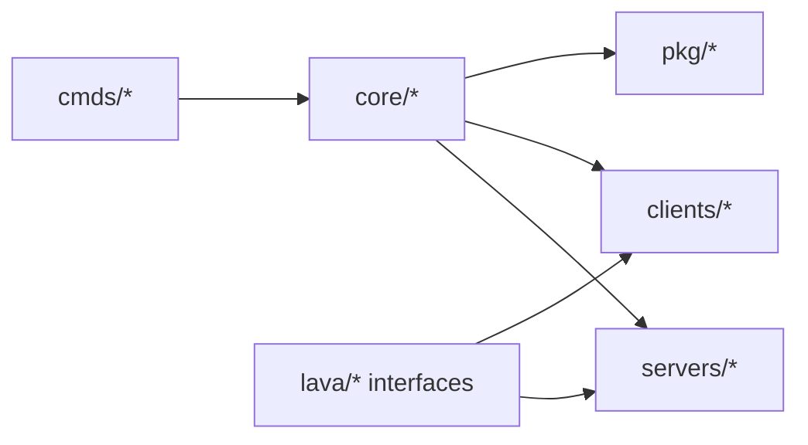

# 模块文档总览

本文档按目录组织 Lava 的模块职责，帮助你快速定位代码入口。

## 分册导航

- [`../architecture-v2.md`](../architecture-v2.md)：全局架构、四条数据通路、部署拓扑（**推荐先读**）
- `core.md`：核心能力模块（supervisor / tunnel / p2p / debug）
- `servers.md`：服务端实现（gatewayserver / https / zrpcs）
- `clients.md`：客户端模块（grpcc / resty / zrpcc）
- `pkg.md`：公共组件（gateway / zrpc / zrpcbridge）
- `cmds.md`：命令模块（含已接入/未接入）
- `lava.md`：接口抽象层
- `internal.md`：内部实现层

相关专题：

- P2P 设计：`../design-p2p.md`
- Gateway 部署/TLS/HTTP/3：`../../pkg/gateway/docs/deploy.md`
- Traefik 示例：`../../deploy/traefik/README.md`

## 目录关系图

