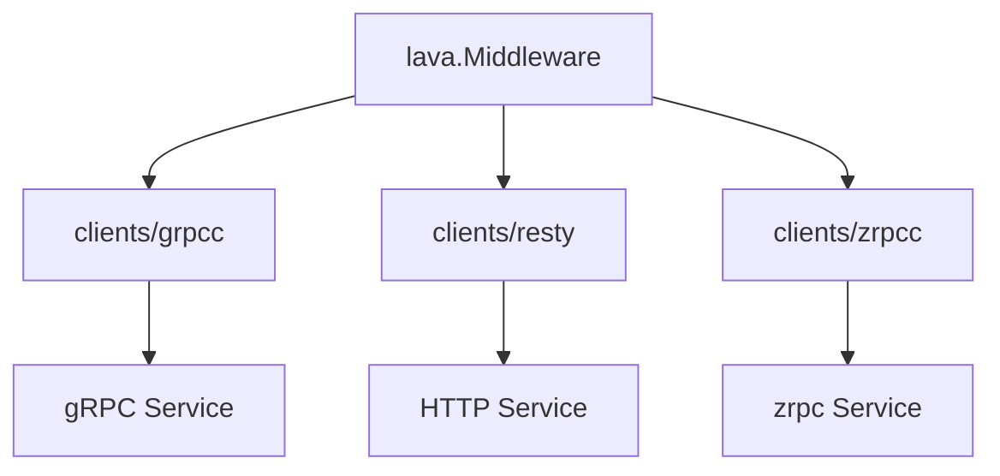

# Clients 模块文档

`clients/*` 提供对下游服务调用能力，覆盖 gRPC 与 HTTP。

## 模块清单

| 模块            | 说明                                               | 关键入口                       |
| --------------- | -------------------------------------------------- | ------------------------------ |
| `clients/grpcc` | gRPC 客户端封装（懒连接、健康检查、Invoke/Stream） | `clients/grpcc/client.go::New` |
| `clients/resty` | HTTP 客户端封装（中间件、重试、配置化）            | `clients/resty/client.go::New` |
| `clients/zrpcc` | zrpc 客户端封装（NATS + protobuf unary）           | `clients/zrpcc/client.go::New` |

## `grpcc` 要点

- 通过 `grpccconfig.Cfg` 管理连接参数
- `Get()` 懒创建连接并缓存
- 暴露 `Invoke` / `NewStream` / `Healthy`

## `resty` 要点

- 默认挂载 serviceinfo/metric/accesslog/recovery 中间件
- 支持重试策略（基于 `DefaultRetryCount/Interval`）
- 通过 `Request` + `Client.Do(ctx, req)` 执行调用

## `zrpcc` 要点

- 基于 `pkg/zrpc.Client` 封装 NATS request-reply 调用
- 默认挂载 serviceinfo/metric/accesslog/recovery 中间件
- 提供 `Conn` / `CallUnary` / `Healthy` / `Close`
- 可与生成的 `*ZrpcClient` 组合使用

## 统一抽象关系

