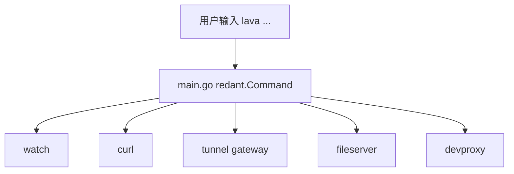

# Cmds 模块文档

`cmds/*` 保存命令实现。由于仓库存在两种入口（`main.go` 与 `lavabuilder.Run`），命令接线状态分为“已接入”和“未接入”。

## 1) `main.go` 已接入命令

| 命令         | 路径                        |
| ------------ | --------------------------- |
| `watch`      | `cmds/watchcmd/cmd.go`      |
| `curl`       | `cmds/curlcmd/cmd.go`       |
| `tunnel`     | `cmds/tunnelcmd/cmd.go`     |
| `fileserver` | `cmds/fileservercmd/cmd.go` |
| `devproxy`   | `cmds/devproxycmd/cmd.go`   |

## 2) `cmds` 中存在但未接入 `main.go`

| 命令包               | 实际 `Use` |
| -------------------- | ---------- |
| `cmds/configcmd`     | `config`   |
| `cmds/depcmd`        | `dep`      |
| `cmds/envcmd`        | `envs`     |
| `cmds/grpcservercmd` | `grpc`     |
| `cmds/healthcmd`     | `health`   |
| `cmds/httpservercmd` | `http`     |
| `cmds/schedulercmd`  | `cron`     |
| `cmds/versioncmd`    | `version`  |

## 3) 常见维护点

1. 新增命令后，确认是否已在 `main.go` 注册。
2. 如果命令只在 DI 场景使用，需在文档注明“入口限制”。
3. 文档示例必须与 `Use` 字段一致（例如 `cron` vs `scheduler`）。

## 4) 命令执行路径（`main.go`）

