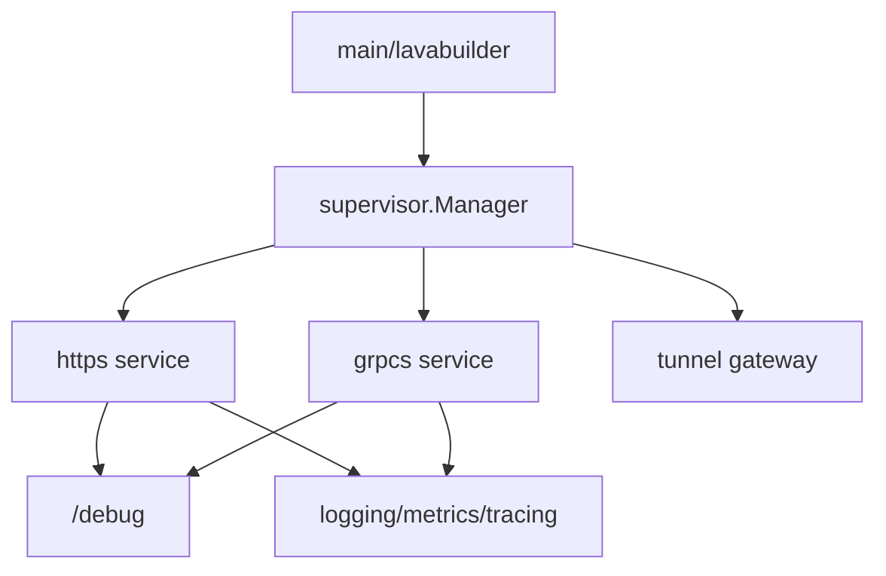

# Core 模块文档

`core/*` 承载框架级能力，是服务编排与运行时能力的基础层。

## 模块清单

| 模块               | 主要职责                   | 关键文件                      |
| ------------------ | -------------------------- | ----------------------------- |
| `core/supervisor`  | 服务生命周期托管与重启策略 | `core/supervisor/manager.go`  |
| `core/debug`       | 调试路由聚合与挂载         | `core/debug/mux.go`           |
| `core/scheduler`   | 任务调度能力               | `core/scheduler/scheduler.go` |
| `core/tunnel`      | 反向连接隧道与代理         | `core/tunnel/doc.go`          |
| `core/logging`     | 日志工厂与 logger 扩展     | `core/logging/factory.go`     |
| `core/metrics`     | 指标驱动与指标工厂         | `core/metrics/factory.go`     |
| `core/tracing`     | OpenTelemetry 初始化与追踪 | `core/tracing/telemetry.go`   |
| `core/discovery`   | 服务发现抽象（含 noop）    | `core/discovery/noop.go`      |
| `core/encoding`    | 编解码器注册与选择         | `core/encoding/encoding.go`   |
| `core/lavabuilder` | DI 初始化与命令装配入口    | `core/lavabuilder/builder.go` |
| `core/signals`     | 系统信号转 context 取消    | `core/signals/signal.go`      |
| `core/lifecycle`   | 生命周期钩子抽象           | `core/lifecycle/lifecycle.go` |

## 典型调用链

## 维护建议

- 任何服务型组件都尽量实现 `supervisor.Service`，避免自管生命周期。
- 调试端点统一走 `core/debug`，避免分散挂载。
- 新模块若涉及跨服务观测，优先接入 `metrics` / `tracing`。
