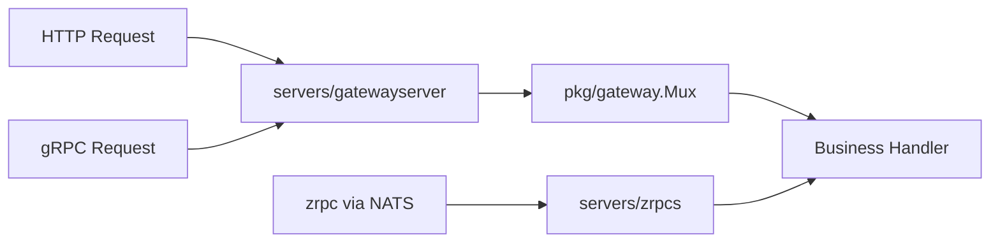

# Servers 模块文档

`servers/*` 提供对外服务能力。

## 模块清单

| 模块 | 说明 | 关键入口 |
| --- | --- | --- |
| `servers/gatewayserver` | 对外 Gateway 服务：HTTP/REST、gRPC-Web、WebSocket、原生 gRPC | `gatewayserver.New` |
| `servers/grpcs` | **已废弃别名**，等同 `gatewayserver`（supervisor 名仍为 `grpc-server`） | `grpcs.New` |
| `servers/https` | Fiber HTTP 服务封装，默认接入 debug 与基础中间件 | `https.New` |
| `servers/zrpcs` | zrpc 服务宿主，基于 NATS 托管 protobuf unary/streaming RPC | `zrpcs.New` |

## `servers/gatewayserver` 要点

- 装配 `pkg/gateway.Mux`，注册 `GrpcRouter` / `GrpcHttpRouter`
- HTTP（Fiber）：REST + gRPC-Web，默认 `/api` 前缀
- 可选 WebSocket 独立端口（`net/http`）
- 可选原生 gRPC 透传（`grpc_passthrough`）
- 通过 `vars.Register` 暴露路由与服务信息（`gateway-server-info`）
- **不包含** NATS/zrpc；见 `pkg/zrpcbridge` 或 `servers/zrpcs`

配置 YAML 键：`gateway_server`（推荐）或 legacy `grpc_server`。

## `servers/https` 要点

- 使用 Fiber 创建 HTTP 服务
- 默认中间件：serviceinfo / metric / accesslog / recovery
- 默认挂载：`/debug`
- 通过 `lava.HttpRouter` 进行路由装配

## `servers/zrpcs` 要点

- 基于 `pkg/zrpc.Server` 管理 NATS queue subscription
- 通过 `RegisterFunc` 装配生成的 `Register...ZrpcRoutes(...)`
- 适合纯 NATS 微服务；若需复用 Gateway handler，使用 `pkg/zrpcbridge.RegisterMux`

## 处理流程

