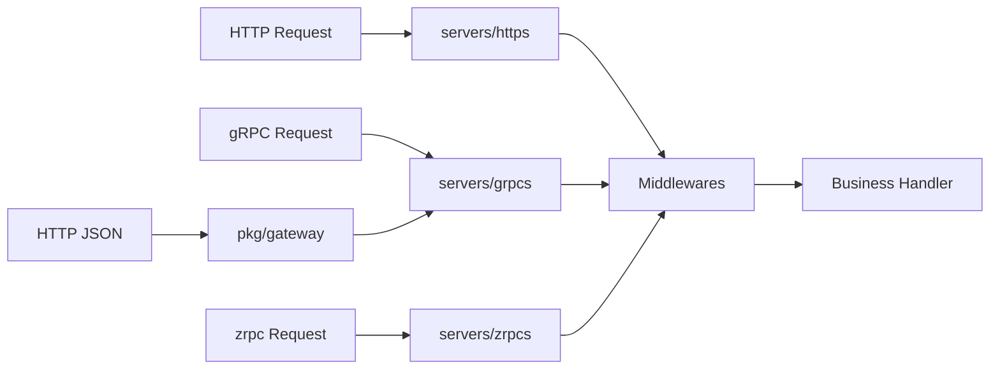

# Servers 模块文档

`servers/*` 提供对外服务能力，当前主要包含 HTTP 与 gRPC 两类服务。

## 模块清单

| 模块            | 说明                                             | 关键入口                       |
| --------------- | ------------------------------------------------ | ------------------------------ |
| `servers/https` | Fiber HTTP 服务封装，默认接入 debug 与基础中间件 | `servers/https/server.go::New` |
| `servers/grpcs` | gRPC + Gateway 一体化服务，支持 gRPC/HTTP 双栈   | `servers/grpcs/server.go::New` |
| `servers/zrpcs` | zrpc 服务宿主，基于 NATS 托管 protobuf unary/streaming RPC | `servers/zrpcs/server.go::New` |

## `servers/https` 要点

- 使用 Fiber 创建 HTTP 服务
- 默认中间件：serviceinfo / metric / accesslog / recovery
- 默认挂载：`/debug`
- 通过 `lava.HttpRouter` 进行路由装配

## `servers/grpcs` 要点

- 基于 `grpc.Server` 注册服务
- 同步注册到 `pkg/gateway.Mux`，支持 HTTP/JSON 调用
- 支持 `GrpcRouter` 与 `GrpcHttpRouter`
- 通过 `vars.Register` 暴露路由与服务信息

## `servers/zrpcs` 要点

- 基于 `pkg/zrpc.Server` 管理 NATS queue subscription
- 默认挂载 serviceinfo/metric/accesslog/recovery 中间件
- 通过 `RegisterFunc` 装配生成的 `Register...ZrpcRoutes(...)`
- 启动/停止输出 info 日志（`url`、`registers`）
- 适合作为内部 RPC 服务宿主

## 处理流程

