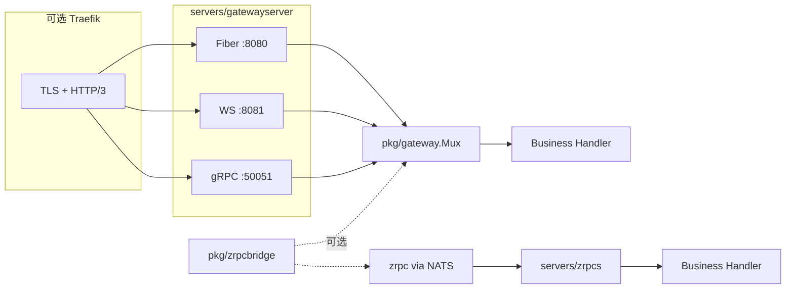

# Servers 模块文档

`servers/*` 提供对外服务能力，由 `core/supervisor` 托管生命周期。

## 模块清单

| 模块 | 说明 | 关键入口 |
| --- | --- | --- |
| `servers/gatewayserver` | 对外 Gateway：HTTP/REST、gRPC-Web、WebSocket、原生 gRPC | `gatewayserver.New` |
| `servers/https` | Fiber HTTP 服务，默认接入 debug 与基础中间件 | `https.New` |
| `servers/zrpcs` | zrpc 服务宿主，基于 NATS 托管 protobuf unary/streaming RPC | `zrpcs.New` |

## `servers/gatewayserver` 要点

对外多协议网关宿主，装配 `pkg/gateway.Mux` 并监听多个端口。

### 监听与协议

| 协议 | 默认端口 | 配置项 | 实现 |
| --- | --- | --- | --- |
| HTTP/REST + gRPC-Web | 8080 | `gateway_server.http` / `running.HttpPort` | Fiber，`/api` 前缀 |
| WebSocket | 8081（可选） | `gateway_server.websocket_port` | `net/http` |
| 原生 gRPC | 50051 | `gateway_server.grpc` / `running.GrpcPort` | `grpc.Server` 或 passthrough |

### 装配流程

1. 收集 `GrpcRouter` / `GrpcHttpRouter` → 注册到 `gateway.Mux`
2. Fiber 挂 `/api` → `mux.Handler`
3. 可选 `websocket_port` → 独立 `http.Server`
4. gRPC：handler 仅在 `gateway.Mux` 注册，原生 gRPC 通过透传接入
5. 全局中间件：serviceinfo / metric / accesslog / recovery
6. `vars.Register` 路由信息（`gateway-server-info`，兼容 `grpc-server-info`）

### 配置

YAML 键：**`gateway_server`**（见 `internal/configs/components/gateway_server.yaml`）。

```yaml
gateway_server:
  enable_print_router: true
  websocket_port: 8081
  http: {}
  grpc: {}
```

### 不包含

- NATS/zrpc（见 `pkg/zrpcbridge` 或 `servers/zrpcs`）
- TLS/HTTPS（见 `deploy/traefik`、`pkg/gateway/docs/deploy.md`）

### 命令入口

`lava grpc` → `cmds/grpcservercmd` → `gatewayserver.New` + `gatewayserver.LoadConfig`

## `servers/https` 要点

- 使用 Fiber 创建 HTTP 服务
- 默认中间件：serviceinfo / metric / accesslog / recovery
- 默认挂载：`/debug`
- 通过 `lava.HttpRouter` 进行路由装配
- 适合纯 REST/页面，不需要 gRPC 协议转换

## `servers/zrpcs` 要点

- 基于 `pkg/zrpc.Server` 管理 NATS queue subscription
- 通过 `RegisterFunc` 装配生成的 `Register...ZrpcRoutes(...)`
- 适合纯 NATS 微服务
- 若需复用 Gateway 上已注册的 handler，在 DI 中调用 `pkg/zrpcbridge.RegisterMux`

## 与部署边缘的关系

生产环境推荐 Traefik 在 `:443` 终止 TLS 并启用 HTTP/3，回源到 gatewayserver 明文端口：

```
Traefik :443 (HTTP/3) → http://gateway:8080   REST + gRPC-Web
                      → http://gateway:8081   WebSocket
                      → h2c://gateway:50051   原生 gRPC
```

配置见 `deploy/traefik/README.md`。

## 处理流程



## 已移除兼容项

| 项 | 说明 |
| --- | --- |
| YAML 键 `grpc_server` | 请使用 `gateway_server` |
| `grpc_passthrough: false` | 双注册模式已删除 |
| `servers/grpcs` 包 | 请使用 `servers/gatewayserver` |

详见 `docs/legacy-removal.md`。
