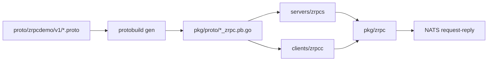

# zrpc 使用说明

`zrpc` 是 Lava 中新增的 **protobuf unary RPC over NATS request-reply** 能力。

它的定位不是替代 gRPC，而是补齐一条更轻量的内部 RPC 通道：

- 消息体使用 protobuf 二进制编码
- 传输层使用 NATS request-reply
- 当前版本聚焦 unary 调用
- 服务端/客户端都可复用 `lava.Middleware`

## 组件位置

| 路径                          | 说明                                                            |
| ----------------------------- | --------------------------------------------------------------- |
| `proto/zrpc/v1/options.proto` | zrpc method 扩展定义（subject / queue / timeout）               |
| `pkg/zrpc/`                   | zrpc Go runtime（client / server / error / request / response） |
| `clients/zrpcc/`              | Lava 风格 zrpc 客户端封装                                       |
| `servers/zrpcs/`              | Lava 风格 zrpc 服务宿主                                         |
| `tools/protoc-gen-zrpc-go/`   | 本地 protoc 插件入口                                            |
| `internal/zrpcgen/`           | zrpc Go 代码生成逻辑                                            |
| `internal/examples/zrpcdemo/` | 最小 demo 服务与测试                                            |

## 运行关系



## Proto 写法

在 `.proto` 中引入 `zrpc/v1/options.proto`，即可为某个 rpc 显式配置 zrpc 绑定信息。

```proto
syntax = "proto3";

package zrpcdemo.v1;

option go_package = "github.com/pubgo/lava/v2/pkg/proto/zrpcdemov1;zrpcdemov1";

import "zrpc/v1/options.proto";

service EchoService {
  rpc Echo(EchoRequest) returns (EchoResponse) {
    option (zrpc.v1.method) = {
      subject: "svc.zrpcdemo.EchoService/Echo"
      queue: "zrpcdemo.echo"
      timeout_ms: 1500
    };
  }

  rpc Reverse(EchoRequest) returns (EchoResponse);
}
```

如果不显式指定，当前默认规则如下：

- `subject`: `svc.{package}.{Service}/{Method}`
- `queue`: `{package}.{service}`（小写）
- `timeout_ms`: `3000`

## 生成代码

仓库根目录执行：

```bash
task proto:gen
```

该任务会先安装本地插件：

- `go install ./tools/protoc-gen-zrpc-go`

再通过 `protobuild gen` 生成：

- `pkg/proto/.../*.pb.go`
- `pkg/proto/.../*_grpc.pb.go`
- `pkg/proto/.../*_zrpc.pb.go`

## 生成产物会提供什么

以 `EchoService` 为例，生成代码会提供：

- `EchoServiceZrpcServer`
- `RegisterEchoServiceZrpcRoutes(...)`
- `RegisterEchoServiceZrpcServer(...)`
- `EchoServiceZrpcClient`
- `NewEchoServiceZrpcClient(...)`

以及每个方法的绑定常量：

- `EchoService_EchoSubject`
- `EchoService_EchoQueue`
- `EchoService_EchoTimeout`

## 服务端接入方式

### 方式 1：直接使用生成的 zrpc server 注册

```go
nc, _ := nats.Connect(nats.DefaultURL)
defer nc.Close()

srv, err := zrpcdemov1.RegisterEchoServiceZrpcServer(nc, echoService{}, "")
if err != nil {
    panic(err)
}
defer srv.Close()
```

### 方式 2：使用 Lava 的 `servers/zrpcs`

这是当前更推荐的框架接入方式：

```go
svc := zrpcs.New(zrpcs.Params{
    Log:    logger,
    Metric: tally.NoopScope,
    Conf:   &zrpcs.Config{URL: "nats://127.0.0.1:4222"},
    Registers: []zrpcs.RegisterFunc{
        func(srv *zrpc.Server) error {
            return zrpcdemov1.RegisterEchoServiceZrpcRoutes(srv, echoService{}, "")
        },
    },
})

if err := svc.Serve(signals.Context()); err != nil {
    panic(err)
}
```

`zrpcs` 默认会挂上：

- `serviceinfo`
- `metric`
- `accesslog`
- `recovery`

## 客户端接入方式

### 方式 1：直接使用生成的 typed client

```go
nc, _ := nats.Connect(nats.DefaultURL)
defer nc.Close()

cli := zrpcdemov1.NewEchoServiceZrpcClient(nc)
resp, err := cli.Echo(ctx, &zrpcdemov1.EchoRequest{Message: "hello"})
```

### 方式 2：使用 Lava 的 `clients/zrpcc`

```go
baseCli := zrpcc.New(&zrpcc.Config{
    URL:     "nats://127.0.0.1:4222",
    Timeout: time.Second,
}, zrpcc.Params{
    Log:    logger,
    Metric: tally.NoopScope,
})
defer baseCli.Close()

nc, err := baseCli.Conn()
if err != nil {
    panic(err)
}

typedCli := zrpcdemov1.NewEchoServiceZrpcClient(nc)
resp, err := typedCli.Reverse(ctx, &zrpcdemov1.EchoRequest{Message: "hello"})
```

`zrpcc` 同样默认挂上：

- `serviceinfo`
- `metric`
- `accesslog`
- `recovery`

## Demo 运行

### 1）先启动 NATS

本地需先有 `nats-server`，默认地址：

- `nats://127.0.0.1:4222`

### 2）启动 demo 服务

```bash
go run ./internal/examples/zrpcdemo
```

可选地指定：

```bash
NATS_URL=nats://127.0.0.1:4222 go run ./internal/examples/zrpcdemo
```

### 3）运行 demo 测试

```bash
go test ./internal/examples/zrpcdemo
```

如果本地没有 `nats-server`，该测试会自动 `Skip`。

## 当前能力边界

当前 `zrpc` 已支持：

- protobuf unary request / response
- method 级 subject / queue / timeout 配置
- 统一 Go runtime
- `zrpcs` / `zrpcc` 框架接入
- generated typed client / server
- `lava.Middleware` 复用

当前仍未覆盖：

- streaming RPC
- HTTP -> zrpc bridge
- gRPC -> zrpc proxy
- 更高层的 `lava.ZrpcRouter` 抽象

## 推荐开发顺序

1. 先写 proto（必要时加 `(zrpc.v1.method)`）
2. 执行 `task proto:gen`
3. 服务端实现 `*ZrpcServer` 接口
4. 用 `Register...ZrpcRoutes(...)` 接到 `zrpcs`
5. 用 `zrpcc` 或生成的 typed client 验证调用