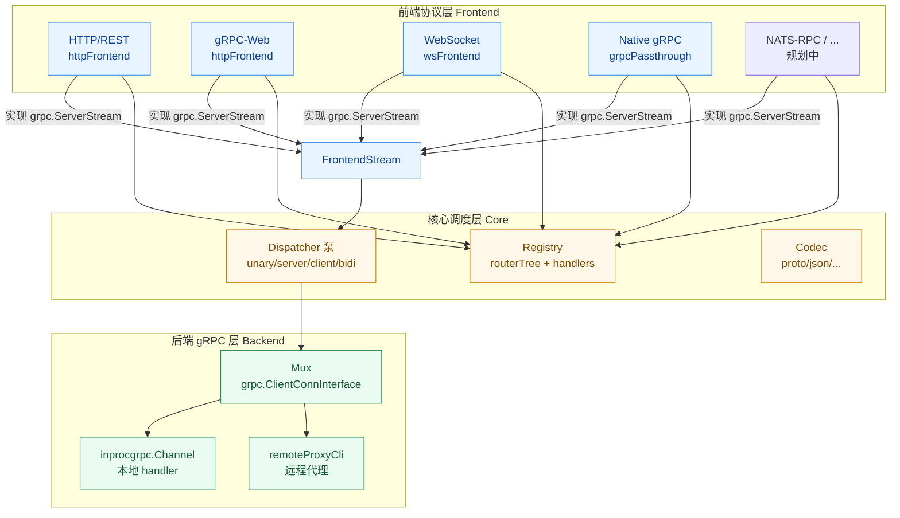
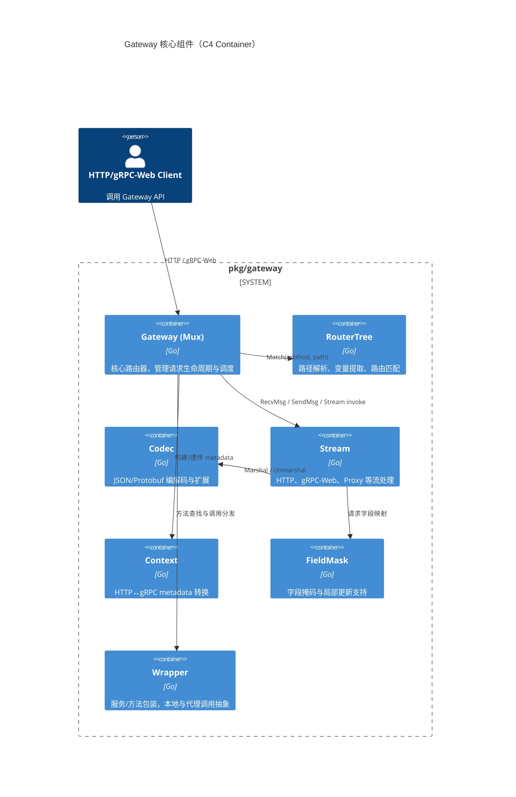
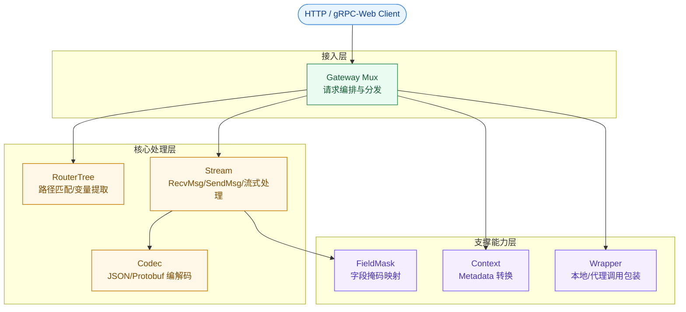
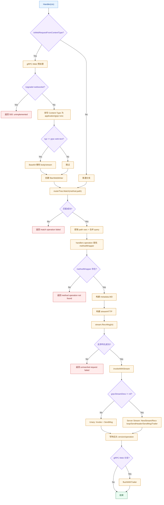
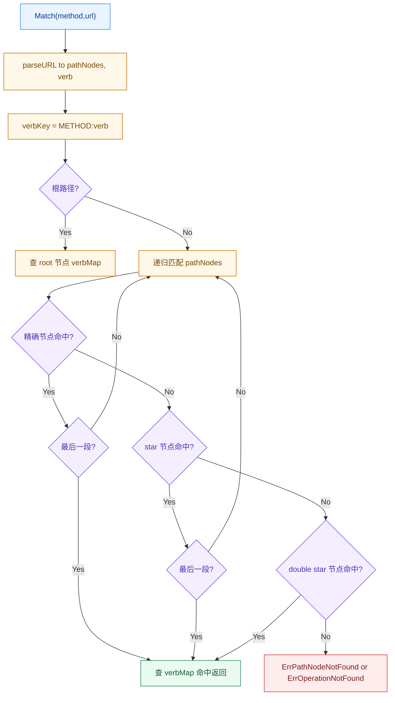
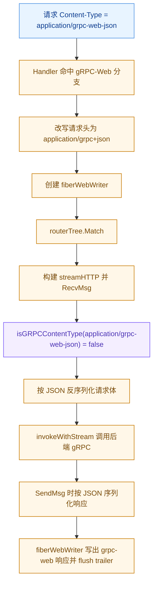
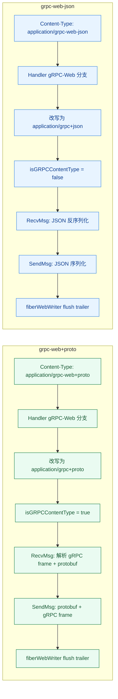

# Gateway 架构设计

本文档详细介绍 Gateway 模块的架构设计、核心组件和数据结构。

## 设计理念

Gateway 模块基于 **Google API HTTP Annotation** 规范，实现了从 HTTP/REST 到 gRPC 的透明转换。其设计遵循以下原则：

1. **声明式路由**：通过 Protobuf 注解定义 HTTP 路由，无需手动编写路由代码
2. **协议透明**：客户端使用标准的 HTTP/JSON，后端使用 gRPC，Gateway 自动处理转换
3. **类型安全**：基于 Protobuf 的类型系统，保证请求/响应的类型安全
4. **可扩展性**：支持自定义编解码器、拦截器、压缩器等扩展点
5. **多协议前端复用**：底层 gRPC handler 注册一次，多种上层协议（HTTP/REST、gRPC-Web、WebSocket 等）共享同一套调度与后端

## 分层架构

Gateway 借鉴 [connectrpc/vanguard-go](https://github.com/connectrpc/vanguard-go) 的核心思想，将请求处理拆分为三层。所有前端协议最终都被归一化为 gRPC 语义的 `grpc.ServerStream`，由统一的 `Dispatcher` 对接后端，从而实现「一套后端 handler 服务多种协议」。



### 三层职责

| 层 | 类型/文件 | 职责 |
| --- | --- | --- |
| 前端协议层 | `httpFrontend`、`wsFrontend`、`GRPCPassthroughStreamHandler` | 协议解帧/编帧、路由或透传、构建流或转发 |
| 核心调度层 | `Dispatcher`(`dispatcher.go`)、`Operation`(`core.go`) | 统一处理四种流模式，对接前端流与后端连接 |
| 后端 gRPC 层 | `Mux`(`mux.go`) 实现 `grpc.ClientConnInterface` | `Invoke`/`NewStream` 分发到 `inprocgrpc` 本地 handler 或远程代理 |

### 核心抽象（core.go）

```go
// Backend：后端统一调度目标，Mux 实现它（Invoke + NewStream）
type Backend = grpc.ClientConnInterface

// FrontendStream：各协议前端归一化后的流，本质是 grpc.ServerStream
type FrontendStream = grpc.ServerStream

// Operation：一个已注册 RPC 方法的元信息
type Operation struct {
    FullMethod string
    InputType  protoreflect.MessageType
    OutputType protoreflect.MessageType
    StreamDesc *grpc.StreamDesc // nil 表示 unary
    Meta       *lavapbv1.RpcMeta
}
```

### Dispatcher 四种流模式

`Dispatcher.Dispatch` 根据 `Operation.StreamDesc` 自动选择流模式：

| 模式 | 判定 | 处理方式 |
| --- | --- | --- |
| Unary | `StreamDesc == nil` | `Invoke` → `SendMsg` |
| Server-Stream | `ServerStreams && !ClientStreams` | `NewStream` → 循环 `RecvMsg`/`SendMsg` |
| Client-Stream | `ClientStreams && !ServerStreams` | 循环 `RecvMsg`/`SendMsg` → 单次响应 |
| Bidi | `ClientStreams && ServerStreams` | 双向泵（复用 `stream.proxy.go` 的 forward 逻辑） |

> 对于 Unary 与 Server-Stream，请求消息由前端预先 `RecvMsg` 读入后传给 `Dispatch`；Client-Stream 与 Bidi 则在泵内部读取。

## 模块结构

```
pkg/gateway/
├── mux.go              # 核心路由器 Mux，实现 Gateway 接口与 Backend
├── core.go             # 核心抽象：Backend / FrontendStream / Operation / Dispatcher
├── dispatcher.go       # 统一调度泵：unary/server/client/bidi 四种流模式
├── frontend_http.go    # HTTP/REST + gRPC-Web 前端（Fiber/fasthttp）
├── frontend_ws.go      # WebSocket 前端（coder/websocket, net/http）
├── frontend_grpc.go    # Native gRPC 透传（UnknownServiceHandler）
├── routertree/         # 路由树实现，负责路径匹配
│   ├── router.go       # 路由树核心逻辑
│   ├── parser.go       # HTTP Rule 路径模板解析器
│   └── lex.go          # 词法分析器
├── codec.go            # 编解码器接口和实现（JSON、Protobuf）
├── stream.go           # ServerTransportStream 等流上下文支持
├── stream.http.go      # HTTP / gRPC-Web 流实现（streamHTTP）
├── stream.grpcweb.go   # gRPC Web 帧写入器（fiberWebWriter）
├── stream.websocket.go # WebSocket 流实现（streamWS，实现 grpc.ServerStream）
├── stream.proxy.go     # 双向代理泵（forwardServerToClient/ClientToServer）
├── context.go          # 上下文和元数据管理
├── util.go             # 工具函数（HTTP Rule 解析、元数据转换等）
├── fieldmask.go        # FieldMask 支持
├── wrapper.go          # 服务和方法包装器（serviceWrapper/methodWrapper）
├── grpccodes.go        # gRPC 错误码到 HTTP 状态码映射
├── gatewayutils/       # Gateway 工具函数
│   ├── query_params.go # 查询参数处理
│   └── trie.go         # Trie 树实现
└── internal/           # 内部实现（压缩器等）
```

## 核心组件



### 核心组件分层（美化版）



## 请求处理流程

```
HTTP Request (JSON / gRPC Web)
    │
    ├─> [1. Handler] 接收 Fiber Context
    │
    ├─> [2. 协议检测]
    │      ├─ HTTP/JSON → 普通流程
    │      └─ gRPC Web → gRPC Web 流程
    │
    ├─> [3. RouterTree.Match]
    │      ├─ 解析 HTTP 方法和路径
    │      ├─ 匹配路由规则（支持通配符、变量、动词）
    │      └─ 提取路径变量和查询参数
    │
    ├─> [4. Method Lookup]
    │      └─ 根据 gRPC 方法名查找对应的 methodWrapper
    │
    ├─> [5. Metadata Conversion]
    │      └─ 将 HTTP 头转换为 gRPC metadata
    │
    ├─> [6. Stream.RecvMsg]
    │      ├─ 根据 body 规则解析请求体
    │      ├─ 合并路径变量和查询参数到消息字段
    │      └─ 执行请求拦截器
    │
    ├─> [7. Mux.Invoke]
    │      ├─ 判断是本地服务还是代理服务
    │      ├─ 本地服务：使用 inprocgrpc.Channel 调用
    │      └─ 代理服务：转发到远程 gRPC 客户端
    │
    ├─> [8. gRPC Service Execution]
    │      ├─ 执行 Unary/Stream 拦截器
    │      └─ 调用实际的 gRPC 服务方法
    │
    ├─> [9. Stream.SendMsg]
    │      ├─ 根据 response_body 规则定位响应字段
    │      ├─ 执行响应编码器
    │      └─ 编码并写入响应
    │
    └─> [10. Response] 返回响应
```

### Handler 详细流程图



### RouterTree.Match 路由匹配流程图



### gRPC-Web-JSON 专项流程图

`application/grpc-web-json` 在当前实现中会走 **gRPC-Web 入口**，但在编解码阶段按 **JSON 传输** 处理（不走 gRPC frame）。



> 说明：`stream.http.go` 中 `isGRPCContentType` 对 `application/grpc-web-json` 做了显式兼容，返回 `false`；相关行为由 `stream_http_test.go` 的 `TestIsGRPCContentType_GrpcWebJSONAlias` 覆盖。

### grpc-web+proto vs grpc-web-json 差异对比

| 维度                | grpc-web+proto                                   | grpc-web-json                      |
| ------------------- | ------------------------------------------------ | ---------------------------------- |
| 入口判定            | `isWebRequestFromContentType` 命中               | `isWebRequestFromContentType` 命中 |
| 请求头改写          | `application/grpc+proto`                         | `application/grpc+json`            |
| `isGRPCContentType` | `true`                                           | `false`（别名按 JSON 处理）        |
| 请求解码            | gRPC frame + protobuf                            | JSON 反序列化                      |
| 响应编码            | protobuf + gRPC frame                            | JSON 序列化                        |
| 输出封装            | 由 `fiberWebWriter` 负责 grpc-web 响应与 trailer | 同左                               |



## 关键数据结构

### 1. Mux（核心路由器）

`Mux` 是 Gateway 的核心结构，实现了 `Gateway` 接口和 `grpc.ClientConnInterface`：

**主要字段：**
- `localClient`: 进程内 gRPC 通道（`inprocgrpc.Channel`），用于调用本地服务
- `routerTree`: 路由树，存储和匹配 HTTP 路由规则
- `opts`: 配置选项，包括编解码器、拦截器、压缩器等

**核心职责：**
- 管理服务注册（本地服务和代理服务）
- 路由匹配和方法查找
- 处理 HTTP 请求到 gRPC 调用的转换
- 管理编解码器和压缩器
- 提供拦截器支持（Unary 和 Stream）

### 2. RouterTree（路由树）

`RouterTree` 基于树形结构实现高效的路径匹配：

```go
type RouteTree struct {
    nodeMap map[string]*nodeTree  // 按 HTTP 方法分组的节点树
}

type nodeTree struct {
    nodeMap map[string]*nodeTree       // 子节点（路径段）
    verbMap map[string]*routeTarget    // 动词到路由目标的映射
}
```

**特性：**
- 路径解析：使用 `participle` 解析 HTTP Rule 路径模板
- 变量提取：支持路径变量（`{field}`）、带模式的变量（`{field=pattern}`）
- 通配符匹配：支持 `*`（单段）和 `**`（多段贪婪匹配）
- 动词支持：支持 `:verb` 后缀用于区分操作

### 3. Codec（编解码器）

**内置编解码器：**
- `CodecJSON`：基于 `protojson` 的 JSON 编解码
- `CodecProto`：Protobuf 二进制格式编解码
- `codecHTTPBody`：原始 HTTP Body 处理

**编解码器接口：**
```go
type Codec interface {
    encoding.Codec
    MarshalAppend([]byte, any) ([]byte, error)
}

type StreamCodec interface {
    Codec
    ReadNext(buf []byte, r io.Reader, limit int) (dst []byte, n int, err error)
    WriteNext(w io.Writer, src []byte) (n int, err error)
}
```

### 4. Stream（流处理）

**流类型：**
- `streamHTTP`：基于 Fiber Context 的 HTTP 请求/响应流
- `fiberWebWriter`：gRPC Web 响应流
- `streamWebSocket`：WebSocket 双向流
- `streamInProcess`：进程内流
- `streamProxy`：代理流

### 5. ServiceWrapper 和 MethodWrapper

**ServiceWrapper：**
- 包装 gRPC 服务描述符和实现
- 区分本地服务和代理服务
- 管理服务的编解码器和拦截器配置

**MethodWrapper：**
- 包装单个 gRPC 方法
- 存储输入/输出消息类型
- 关联 HTTP Rule 配置和路径变量信息

## 性能特性

- **路由匹配**：O(d) 时间复杂度，d 是路径深度
- **进程内调用**：零网络开销，直接方法调用
- **内存优化**：使用前缀树共享公共路径前缀
- **并发安全**：Gateway 无状态，可安全并发处理请求

## 依赖关系

- `google.golang.org/grpc`：gRPC 核心库
- `google.golang.org/protobuf`：Protobuf 运行时
- `github.com/gofiber/fiber/v3`：HTTP 框架
- `github.com/fullstorydev/grpchan/inprocgrpc`：进程内 gRPC 通道
- `github.com/alecthomas/participle/v2`：路径模板解析器
